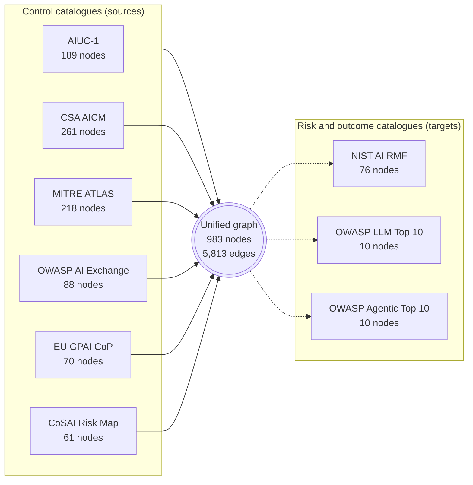
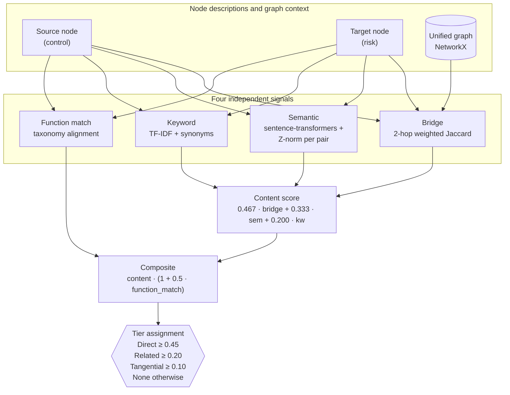
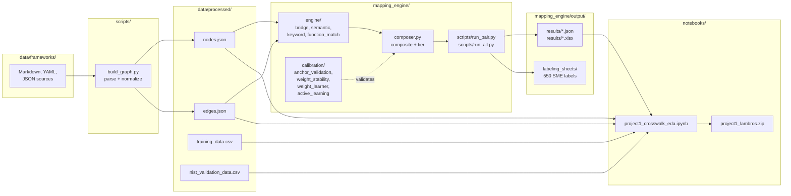
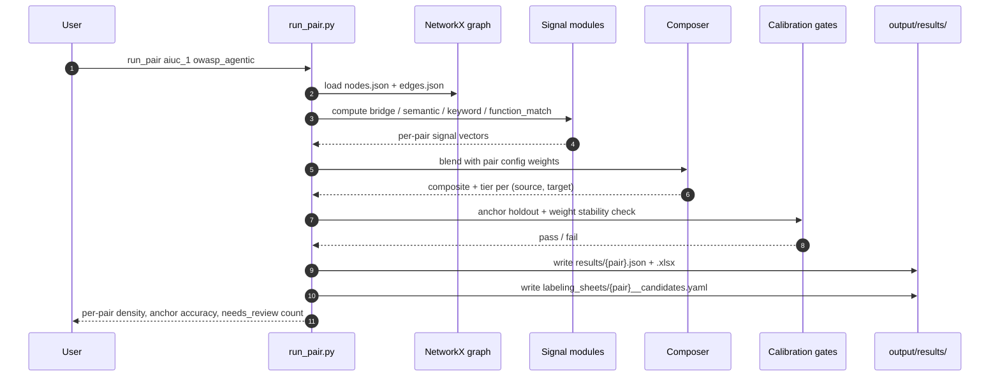
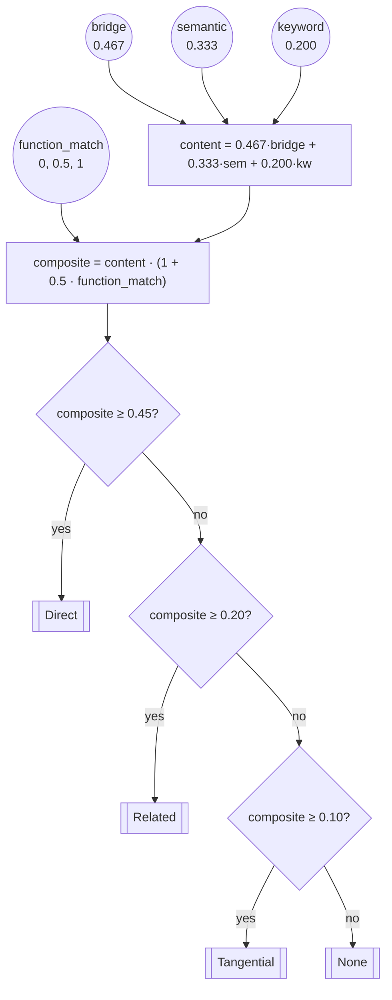
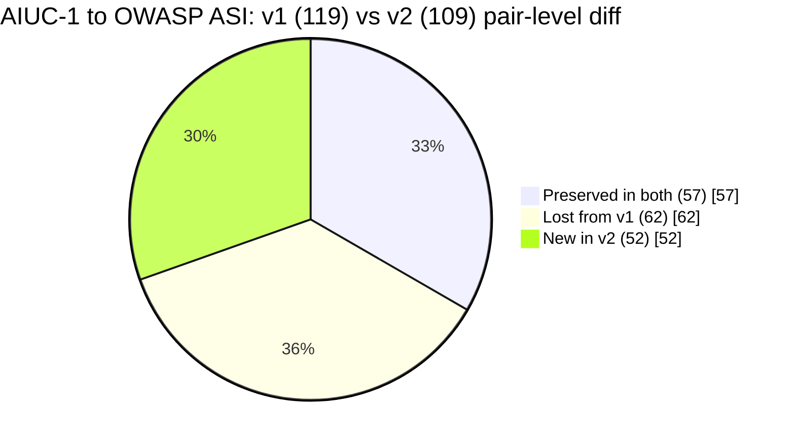
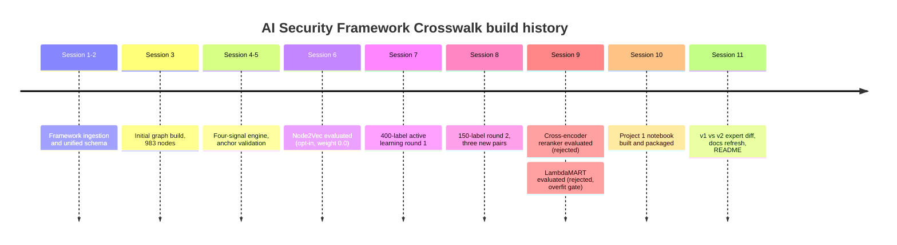

# AI Security Framework Crosswalk

A unified graph and mapping engine that connects nine major AI security standards to each other, so that a security architect, auditor, or researcher can walk from any control in one framework to the related controls, risks, and mitigations in every other framework without manually re-reading thousands of pages of documentation.

The repository contains the raw framework source content, a typed graph built from it, a multi-signal mapping engine that proposes cross-framework relationships, a set of evaluation and calibration scripts that keep the engine honest, and a scientific notebook that explains the whole thing with figures. It is the midterm deliverable for COMP 4433 Data Visualization at the University of Denver (Spring 2026), and a reusable artifact for the AI security standards community.

## Table of contents

1. [Why this exists](#why-this-exists)
2. [What is actually in the box](#what-is-actually-in-the-box)
3. [The nine frameworks and the shape of the graph](#the-nine-frameworks-and-the-shape-of-the-graph)
4. [How the mapping engine scores a pair](#how-the-mapping-engine-scores-a-pair)
5. [System architecture](#system-architecture)
6. [Pipeline flow](#pipeline-flow)
7. [Composite signal blend](#composite-signal-blend)
8. [How we avoided overfitting](#how-we-avoided-overfitting)
9. [Project 1: the scientific notebook](#project-1-the-scientific-notebook)
10. [v1 expert crosswalk vs v2 pipeline output](#v1-expert-crosswalk-vs-v2-pipeline-output)
11. [Repository layout](#repository-layout)
12. [Getting started](#getting-started)
13. [Session history](#session-history)
14. [License and attribution](#license-and-attribution)

## Why this exists

AI security standards are fragmented in a way that makes life hard for anyone who has to comply with more than one at the same time. OWASP publishes one top ten list for LLM applications and a second, different top ten list for agentic applications. MITRE ships ATLAS, a tactic-and-technique catalogue modeled on ATT&CK but scoped to adversarial ML. NIST publishes the AI Risk Management Framework, which is outcome oriented rather than control oriented. CSA publishes the AI Controls Matrix, which is very control oriented and very long. AIUC-1 is an emerging private-sector control catalogue. EU policy teams publish the GPAI Code of Practice. Every one of these documents is useful, every one of them overlaps with the others, and none of them reference each other in a machine-readable way.

If you are a security architect trying to write a policy that satisfies NIST, maps cleanly onto the OWASP agentic risks your red team found last week, and will survive an AIUC-1 audit next quarter, you have to do the crosswalk in your head or in a spreadsheet. That is slow, error prone, and does not scale to nine frameworks. This project automates the spreadsheet.

## What is actually in the box

Three things, stacked on top of each other:

**A typed graph.** Every entry in every framework becomes a node with a stable identifier, a framework tag, an entry type (control, risk, technique, requirement, subcategory), a natural-language description, and a function class (PREVENT, DETECT, ISOLATE, RESPOND, GOVERN, and so on). Every explicit reference inside the framework source documents becomes an edge between two nodes. The graph is stored as `nodes.json` and `edges.json` in `data/processed/` and loaded into NetworkX on demand.

**A mapping engine.** Given a pair of frameworks, the engine walks both node sets and scores every candidate (source, target) pair using four content signals and a multiplicative function-match boost. The four signals are a graph bridge based on two-hop weighted Jaccard over shared neighbors, a semantic similarity over sentence embeddings, a TF-IDF keyword match with synonym expansion, and a function-class alignment signal. The scores are combined into a single composite value between zero and one, and that composite is mapped to a tier (Direct, Related, Tangential, or None) using calibrated thresholds.

**A scientific notebook.** `notebooks/project1_crosswalk_eda.ipynb` walks through the dataset with matplotlib and seaborn and narrates what it sees. It is written for a reader who has not seen the code and does not want to read any of it. Every figure has a paragraph of explanation before it and a paragraph of interpretation after it. The full packaged submission lives at `notebooks/project1_lambros.zip`.

## The nine frameworks and the shape of the graph

The current graph contains **983 nodes and 5,813 edges** spread across nine frameworks. The distribution is lopsided, and the lopsidedness is informative.

| Framework | Version | Nodes | Outbound edges | Inbound edges | Role in the graph |
|---|---|---:|---:|---:|---|
| AIUC-1 | 1.0 | 189 | 2,894 | 2,148 | Comprehensive control catalogue, densest source |
| CSA AICM | Current | 261 | 2,012 | 2,335 | Second-largest control catalogue, bidirectional hub |
| MITRE ATLAS | Current | 218 | 421 | 482 | Adversarial ML tactics and techniques |
| OWASP AI Exchange | Current | 88 | 289 | 289 | Curated risk and mitigation encyclopedia |
| NIST AI RMF | 1.0 | 76 | 0 | 152 | Outcome-oriented, target-only |
| EU GPAI Code of Practice | 2025 | 70 | 32 | 92 | Policy commitments from EU GPAI working groups |
| CoSAI Risk Map | Current | 61 | 165 | 118 | Coalition for Secure AI risk taxonomy |
| MITRE-adjacent OWASP LLM Top 10 | 2025 | 10 | 0 | 78 | Target-only, 10 headline risks |
| OWASP Agentic Top 10 | 2026 | 10 | 0 | 119 | Target-only, 10 headline risks |

Three frameworks (NIST AI RMF, OWASP LLM Top 10, OWASP Agentic Top 10) act as **targets only** in the current pipeline. They describe risks and outcomes rather than reusable controls, so the natural direction of traversal is from a control catalogue into them. AIUC-1 and CSA AICM are the two dominant sources. Forty nodes are currently orphans (zero in-degree and zero out-degree), and most of those concentrate in NIST AI RMF and OWASP AI Exchange, which is a diagnostic flag for the next round of active-learning review rather than a bug.



## How the mapping engine scores a pair

When the engine is asked whether a specific (source, target) pair should be a mapping, it does not ask a single big neural network to make a call. It computes four lightweight signals, each of which captures a different kind of evidence, and then blends them into a composite. The reason for the multi-signal design is that each signal fails in a different way, so blending them averages out the individual failure modes.

**Signal 1: reference bridge.** This is a structural signal. Two nodes are more likely to be related if they share neighbors in the graph. The engine implements a two-hop weighted Jaccard over the outgoing neighborhood of the source and the incoming neighborhood of the target, weighted by edge confidence. If AIUC-1 control `B005` already links to OWASP AI Exchange risk `AIX.42`, and that exchange risk already links to OWASP ASI risk `ASI01`, then `B005 -> ASI01` gets a bridge score that reflects that indirect path. The bridge is the signal that generalizes across frameworks without any framework-specific code.

**Signal 2: semantic similarity.** This is a content signal. The engine runs both descriptions through a sentence-transformer model, computes cosine similarity between the resulting vectors, and Z-normalizes the score per pair so that a 0.8 cosine on one framework pair is comparable to a 0.8 cosine on another pair. Semantic is the signal that picks up paraphrases and synonyms that keyword match misses.

**Signal 3: keyword match.** This is a surface-level lexical signal. The engine builds a TF-IDF representation of both descriptions, expands tokens through a shared synonym dictionary (for example, "auth" and "authentication" and "authz" all collapse to a single token), and scores the overlap. Keyword is the signal that catches exact terminology matches even when the semantic model is uncertain.

**Signal 4: function-class match.** This is a taxonomy signal. Every control and every risk is annotated with a function class drawn from a small ontology (PREVENT, DETECT, ISOLATE, RESPOND, GOVERN, SCOPE, VALIDATE, GATE, DISCLOSE). A PREVENT control mapped to a PREVENT risk gets a boost. Complementary pairs (PREVENT and DETECT, SCOPE and ISOLATE) get a smaller boost. This signal exists because two nodes can share a lot of vocabulary and still be unrelated if one of them is a governance policy and the other is an incident response playbook.

The four signals are combined in a two-stage composite. The first three (bridge, semantic, keyword) are blended linearly into a **content score** using hand-tuned weights (bridge 0.467, semantic 0.333, keyword 0.200). The content score is then multiplied by `(1 + 0.5 * function_match)` to produce the final composite. That multiplicative structure matters. It means the function-match signal can promote a merely decent content match into a strong one, but it cannot invent a relationship out of nothing. A pair with near-zero content similarity stays near zero regardless of function alignment.



## System architecture

The codebase separates concerns along three layers: **ingestion**, which pulls every framework from its original markdown, YAML, or JSON source and normalizes it into the graph schema; **mapping**, which runs the four signals and the composite blend for a given pair of frameworks; and **evaluation**, which keeps the mapping layer honest through anchor validation, weight stability tests, active-learning labeling rounds, and per-pair frozen parity tests pinned into the test suite.



## Pipeline flow

The sequence below is what happens when a user asks the system to map a new framework pair. Every stage writes intermediate artifacts to disk so that downstream stages can be rerun in isolation and so that the notebook can load them later without re-running any ML.



## Composite signal blend

The production composite uses hand-tuned weights because every attempt to replace them with a learned model was rejected for principled reasons. Logistic regression and LightGBM were both trained on the 119 AIUC-1 expert pairs plus sampled negatives and evaluated on a held-out NIST validation set. The learned models recovered a few additional true positives at the cost of a larger number of false positives, which is the wrong tradeoff for a tool whose primary user is an auditor triaging alerts rather than a researcher building an exhaustive map. The coefficients from both learned models are archived and used in the notebook to draw honest ROC curves alongside the hand-tuned baseline.



## How we avoided overfitting

The mapping problem has a nasty property that the team discovered the hard way: the active learner that proposes candidates for human review preferentially picks the cases where the composite is least confident, which means the resulting labels are **uncertainty sampled** rather than uniformly sampled. If you train on uncertainty-sampled labels and evaluate on uncertainty-sampled labels, every improvement looks smaller than it really is, and every adopted change is a coin flip. The calibration layer exists to push back on that.

Each pipeline run through `run_pair.py` reports three hard gates before its output is considered production quality. First, an **anchor holdout**: a small set of expert-validated pairs is held out of the signal computation, and all held-out pairs must land in their expected tier or the run fails. Second, a **weight stability check**: each weight is perturbed by fifteen percent in both directions and the run fails if more than twenty percent of mappings change tier. Third, a **density gate**: the total number of produced mappings must fall within a factor of two to three of the density measured on previously validated pairs, to catch runaway false-positive blowups.

On top of those, the test suite contains a **frozen parity test** (`mapping_engine/tests/test_s9_s8_parity.py`) that pins the tier accuracy of three specific pairs against the 550-label SME set from sessions seven through nine. Any future scoring change has to be non-inferior to those frozen targets or the test fails. This is how we make sure that a clever improvement on one pair does not quietly break another.

Several enhancements were explored and then rejected under these rules. Cross-encoder reranking (both `ms-marco-MiniLM-L-6-v2` and `BAAI/bge-reranker-v2-m3`) failed non-inferiority on the SME pool and is not enabled. LambdaMART (XGBoost `rank:pairwise`) failed the session 9 phase E overfit gate with a delta below the 0.02 required improvement. Node2Vec embeddings are committed to the codebase as an opt-in signal at production weight zero because the structural information was already captured by the bridge signal. Contrastive fine-tuning of the embedding model was evaluated and the base model was retained. Documenting what you decided not to ship is often more useful than documenting what you did, and the `data/processed/*_benchmark.json` files preserve the receipts.

## Project 1: the scientific notebook

`notebooks/project1_crosswalk_eda.ipynb` is a 45-cell narrative tour of the dataset written for a technical audience that has not seen any of the underlying code. It is the COMP 4433 midterm deliverable and it satisfies every course requirement (a gridspec multipanel figure with differentially sized axes, at least three different plot types, on-plot annotations, narrative text before and after every figure, discussion of analytical approaches). Every figure in the notebook loads pre-computed results from `data/processed/` and renders them with matplotlib and seaborn only. The notebook does no ML and no GPU work at render time, which keeps it reproducible on any machine and makes it fast to grade.

The notebook is organized into seven sections:

1. **Title and abstract.** States the dataset, the questions, the audience, and the deliverable scope.
2. **Setup and data loading.** Imports the scientific Python stack, resolves the data directory from any working directory (repo root, `notebooks/`, or an unzipped submission folder), and loads every artifact up front so missing files fail fast.
3. **The dataset: framework landscape.** Visualizes the lopsided framework distribution, cross-framework edge density, and entry-type composition. The headline figure here is a gridspec with a wide heatmap next to two narrow bar panels.
4. **Signal analysis.** Compares the distributions of each signal across mapped and unmapped pairs, shows the bridge v1 vs v2 scatter, and visualizes the signal correlation matrix so the reader can see which signals are independent and which overlap.
5. **Feature relevance across weighting strategies.** A four-bar grouped comparison of how hand-tuned, logistic, LightGBM, and ordinal regression weight each signal. Framed as descriptive feature exploration, not model selection. Includes marginal distributions of every signal (Figure 4.0) and a composite-by-target-risk boxplot (Figure 4.5) so the reader sees the univariate shape and the categorical shift alongside the signal correlations.
6. **Coverage, gaps, and graph structure.** Coverage completeness heatmap, orphan counts by framework, Node2Vec UMAP projection, and a new subsection (6.4) that diffs the 119-pair expert v1 crosswalk against the 109-pair v2 pipeline output.
7. **Analytical approaches and next steps.** Course-vocabulary mapping (descriptive, diagnostic, explanatory, confirmatory) and a paragraph on what each future analytical technique would need in order to be credible.

The full executed notebook, plus every data file required to re-execute it from a fresh unzip, is packaged in `notebooks/project1_lambros.zip`.

## v1 expert crosswalk vs v2 pipeline output

The only framework pair in this study that has a hand-crafted expert crosswalk is AIUC-1 to OWASP Agentic Top 10. The upstream `AIUC_2_OWASP_Agentic_Top_10` repository ships 119 expert-authored (control, risk) pairs with Primary and Secondary tiers. The session 11 diff compared those 119 against the 109 pairs produced by the current v2 pipeline.



Fifty seven of the 119 expert pairs survive in v2, which is a 47.9 percent overlap rate. Sixty two are lost, and fifty two are new. None of the preserved pairs flipped tier. The lost set is the natural queue for the next active-learning round. The full written analysis lives at [`data/processed/V1_VS_V2_COMPARISON_REPORT.md`](data/processed/V1_VS_V2_COMPARISON_REPORT.md). This is a descriptive comparison of two snapshots of the same mapping problem, not a judgment on which one is correct.

Two things about the diff are worth emphasizing for a reader. First, the fact that the pipeline surfaces fifty two new pairs the human expert did not flag is evidence that the expert set was not exhaustive. Hand-crafted crosswalks are laborious, and experts miss things under time pressure. Second, the fact that sixty two expert pairs fell below the production threshold is not evidence that the pipeline is wrong; it is evidence that the composite is conservative on cases where the semantic and keyword signals are both weak even when a human can see the relationship. That is exactly the kind of gap active learning is designed to close.

## Repository layout

```
ai-security-framework-crosswalk/
├── data/
│   ├── frameworks/                     # raw source files per framework
│   │   ├── aiuc-1/                     # AIUC-1 JSON + markdown
│   │   ├── csa-aicm/                   # CSA AICM JSON
│   │   ├── mitre-atlas/                # ATLAS YAML + JSON
│   │   ├── nist-ai-rmf/                # NIST AI RMF markdown
│   │   ├── owasp-llm-top10/            # OWASP LLM 2025
│   │   ├── owasp-agentic-top10/        # OWASP Agentic 2026
│   │   ├── owasp-ai-exchange/          # OWASP AI Exchange
│   │   ├── eu-gpai-code-of-practice/   # EU GPAI CoP
│   │   └── cosai/                      # CoSAI Risk Map
│   └── processed/                      # build output (loaded by notebook)
│       ├── nodes.json                  # 983 nodes
│       ├── edges.json                  # 5,813 edges
│       ├── graph_stats.json            # summary counts per framework
│       ├── training_data.csv           # labeled pairs for weight learning
│       ├── nist_validation_data.csv    # held-out validation set
│       ├── learned_weights.json        # logistic + ordinal coefficients
│       ├── weight_comparison.json      # hand-tuned vs learned
│       ├── bridge_comparison.csv       # v1 vs v2 bridge scores
│       ├── v1_vs_v2_comparison.json    # session 11 diff artifact
│       ├── V1_VS_V2_COMPARISON_REPORT.md
│       └── *_benchmark.json            # rejected-improvement receipts
├── mapping_engine/
│   ├── config/                         # per-pair YAML + defaults
│   ├── engine/                         # signal modules + composer
│   ├── calibration/                    # anchor, stability, learner, active learning
│   ├── scripts/                        # run_pair, run_all, v1_vs_v2_diff
│   ├── output/
│   │   ├── results/                    # per-pair JSON and XLSX mappings
│   │   └── labeling_sheets/            # 550 SME labels, frozen
│   └── tests/                          # 89 unit + integration tests
├── notebooks/
│   ├── build_project1_notebook.py      # idempotent builder
│   ├── project1_crosswalk_eda.ipynb    # executed notebook
│   ├── project1_submission/            # self-contained submission folder
│   └── project1_lambros.zip            # final deliverable
├── schema/                             # unified graph schema v1.0
├── scripts/                            # build + conversion scripts
├── docs/                               # SESSION_CONTEXT + IMPROVEMENT_PLAN
├── requirements.txt
└── README.md
```

## Getting started

```bash
# 1. Clone and install
git clone https://github.com/rocklambros/ai-security-framework-crosswalk.git
cd ai-security-framework-crosswalk
pip install -r requirements.txt

# 2. Open the Project 1 notebook
jupyter lab notebooks/project1_crosswalk_eda.ipynb

# 3. Or run the mapping engine end to end for one pair
python -m mapping_engine.scripts.run_pair aiuc_1 owasp_agentic

# 4. Or run the full test suite
pytest mapping_engine/ -q
```

The notebook runs with matplotlib, seaborn, pandas, numpy, and NetworkX only and does not require a GPU. The mapping engine runs on CPU by default and will use CUDA if it is available. Framework source content retains its original licensing; the derived graph and the analysis code are MIT.

## Session history

The project was built incrementally across eleven sessions, each with explicit decision gates. Every rejected enhancement has a receipt in `data/processed/` or `docs/`.



Detailed per-session notes live in [`docs/SESSION_CONTEXT.md`](docs/SESSION_CONTEXT.md) and phase-level status lives in [`docs/IMPROVEMENT_PLAN.md`](docs/IMPROVEMENT_PLAN.md).

## License and attribution

Analysis code, the mapping engine, the notebook, and the derived graph are released under the **MIT License**. Framework source content in `data/frameworks/` retains the original license of each source framework, which is one of CC-BY-SA 4.0 (OWASP, OWASP AI Exchange), Apache 2.0 (MITRE ATLAS), public domain (NIST), a proprietary CSA license (CSA AICM, distributed content derived from their public JSON only), and public terms from AIUC-1 and CoSAI. If you reuse the graph or the mapping engine, please preserve attribution to the original framework authors and to this repository.
