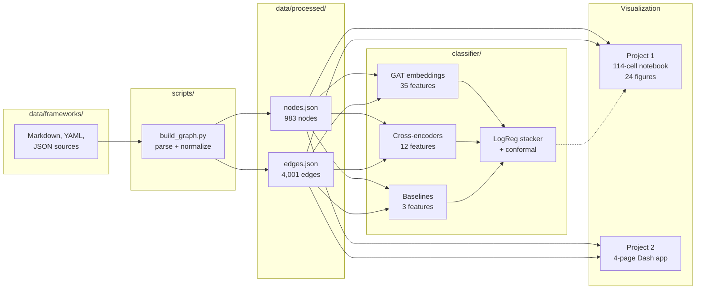
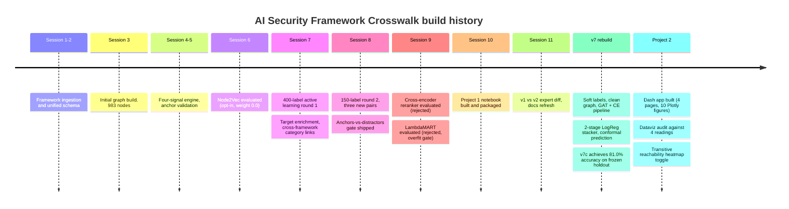

# AI Security Framework Crosswalk

A unified graph, classifier, and interactive explorer that connects nine major AI security standards to each other, so that a security architect, auditor, or researcher can walk from any control in one framework to the related controls, risks, and mitigations in every other framework without manually re-reading thousands of pages of documentation.

The repository contains the raw framework source content, a typed graph built from it, a v7c ensemble classifier that predicts relationship tiers between any two nodes, a scientific notebook that explains the whole thing with 24 figures, and an interactive Dash application for real-time exploration. It is the deliverable for COMP 4433 Data Visualization at the University of Denver (Spring 2026), and a reusable artifact for the AI security standards community.

## Table of contents

1. [Why this exists](#why-this-exists)
2. [What is actually in the box](#what-is-actually-in-the-box)
3. [The nine frameworks and the shape of the graph](#the-nine-frameworks-and-the-shape-of-the-graph)
4. [The v7c classifier](#the-v7c-classifier)
5. [How the legacy mapping engine scores a pair](#how-the-legacy-mapping-engine-scores-a-pair)
6. [System architecture](#system-architecture)
7. [Project 1: the scientific notebook](#project-1-the-scientific-notebook)
8. [Project 2: the interactive crosswalk explorer](#project-2-the-interactive-crosswalk-explorer)
9. [Repository layout](#repository-layout)
10. [Getting started](#getting-started)
11. [Session history](#session-history)
12. [License and attribution](#license-and-attribution)

## Why this exists

AI security standards are fragmented in a way that makes life hard for anyone who has to comply with more than one at the same time. OWASP publishes one top ten list for LLM applications and a second, different top ten list for agentic applications. MITRE ships ATLAS, a tactic-and-technique catalogue modeled on ATT&CK but scoped to adversarial ML. NIST publishes the AI Risk Management Framework, which is outcome oriented rather than control oriented. CSA publishes the AI Controls Matrix, which is very control oriented and very long. AIUC-1 is an emerging private-sector control catalogue. EU policy teams publish the GPAI Code of Practice. Every one of these documents is useful, every one of them overlaps with the others, and none of them reference each other in a machine-readable way.

If you are a security architect trying to write a policy that satisfies NIST, maps cleanly onto the OWASP agentic risks your red team found last week, and will survive an AIUC-1 audit next quarter, you have to do the crosswalk in your head or in a spreadsheet. That is slow, error prone, and does not scale to nine frameworks. This project automates the spreadsheet.

## What is actually in the box

Five things, stacked on top of each other:

**A typed graph.** Every entry in every framework becomes a node with a stable identifier, a framework tag, an entry type (control, risk, technique, requirement, subcategory), a natural-language description, and a domain class. Every explicit reference inside the framework source documents becomes an edge between two nodes. The graph is stored as `nodes.json` and `edges.json` in `data/processed/` and loaded into NetworkX or pandas on demand. The current graph contains **983 nodes and 4,001 edges**, augmented to **4,342 edges** when upstream-sourced mappings are merged.

**A v7c ensemble classifier.** A two-stage ML pipeline that predicts relationship tiers (Unrelated, Partial, Related, Equivalent) for any pair of nodes from different frameworks. Stage 1 extracts 50 features per pair from a Graph Attention Network, three cross-encoder transformer models, and three baseline signals. Stage 2 is a regularized logistic regression with conformal prediction wrapping. The classifier achieves **81.0% exact-tier accuracy** and **94.4% adjacent accuracy** on a 179-pair expert-labeled holdout test set. Full details in the [classifier section](#the-v7c-classifier) below.

**A legacy mapping engine.** The predecessor to the v7c classifier. Given a pair of frameworks, the engine walks both node sets and scores every candidate (source, target) pair using four content signals (graph bridge, semantic similarity, keyword match, function-class alignment) and a multiplicative function-match boost. The scores are combined into a single composite and mapped to a tier using calibrated thresholds. Still used for initial candidate generation.

**A scientific notebook.** `project1/COMP_4433_RockLambros_project1_crosswalk_eda.ipynb` walks through the dataset with 24 figures across 114 cells, narrating the graph structure, feature distributions, classifier evaluation, conformal prediction, and transitive reachability analysis. It is written for a reader who has not seen the code and does not want to read any of it. Every figure has a paragraph of explanation before it, a paragraph of interpretation after it, and a "Plain English" callout summarizing the takeaway.

**An interactive Dash application.** `project2/` is a four-page web app for real-time exploration of the crosswalk. A framework landscape page shows the ecosystem-level network and a pairwise heatmap with a toggle between direct edges and transitive reachability. A deep dive page lets you drill from framework to domain to individual control. A crosswalk explorer shows Sankey diagrams, neighborhood graphs, and expandable control cards with bridge path visualization. A coverage page shows radar and stacked bar charts quantifying compliance gaps.

## The nine frameworks and the shape of the graph

The current graph contains **983 nodes and 4,001 base edges** (4,342 with upstream enrichments) spread across nine frameworks. The distribution is lopsided, and the lopsidedness is informative.

| Framework | Version | Nodes | Role in the graph |
|---|---|---:|---|
| CSA AICM | Current | 261 | Largest control catalogue, dense bidirectional hub |
| MITRE ATLAS | Current | 218 | Adversarial ML tactics and techniques |
| AIUC-1 | 1.0 | 189 | Comprehensive control catalogue, densest edge source |
| OWASP AI Exchange | Current | 88 | Curated risk and mitigation encyclopedia |
| NIST AI RMF | 1.0 | 76 | Outcome-oriented risk management framework |
| EU GPAI Code of Practice | 2025 | 70 | Policy commitments from EU GPAI working groups |
| CoSAI Risk Map | Current | 61 | Coalition for Secure AI risk taxonomy |
| OWASP LLM Top 10 | 2025 | 10 | 10 headline risks for LLM applications |
| OWASP Agentic Top 10 | 2026 | 10 | 10 headline risks for agentic AI systems |

AIUC-1 acts as the primary **hub**: most cross-framework edges pass through it because active labeling sessions concentrated there first (highest expected coverage per hour of SME review). This hub-and-spoke topology means many framework pairs that share zero direct edges are still reachable via two-hop transitive paths through AIUC-1. For example, MITRE ATLAS and CSA AICM have zero direct edges but 629 unique node pairs reachable transitively. Only three framework pairs are completely disconnected in both modes: CoSAI to CSA AICM, CoSAI to OWASP AI Exchange, and CoSAI to EU GPAI.


## The v7c classifier

The current production classifier is v7c, a two-stage ensemble trained on 477 expert-labeled calibration pairs and evaluated on a 179-pair frozen holdout test set.

### Stage 1: Feature extraction (50 features per pair)

| Feature family | Count | Source |
|---|---:|---|
| GAT embedding | 35 | Graph Attention Network: cosine, L2, dot product, and 32 per-dimension differences |
| Cross-encoder soft probabilities | 12 | DeBERTa-v3-large (4), RoBERTa-large (4), DeBERTa-v3-base (4) |
| Baseline | 3 | BGE cosine similarity, BM25 lexical overlap, graph bridge score |

The GAT is trained on the graph structure via contrastive pre-training. The three cross-encoder models are fine-tuned on the training split and produce per-class soft probability vectors. The baseline features are computed without any learned parameters.

### Stage 2: Stacker with conformal prediction

A regularized logistic regression (C=0.01) takes the 50 features and predicts one of four ordinal tiers: Unrelated, Partial, Related, or Equivalent. The stacker is wrapped in a conformal prediction layer that produces calibrated prediction sets with guaranteed coverage.

### Results on the frozen 179-pair holdout

| Metric | Value |
|---|---|
| Exact-tier accuracy | 81.0% |
| Adjacent accuracy (within 1 tier) | 94.4% |
| Macro F1 | 0.43 |
| Conformal coverage (90% target) | 91.6% |
| Mean prediction set size | 1.29 |

### Pipeline evolution

The classifier evolved through seven major versions (v1 through v7c), each with explicit decision gates. Rejected enhancements are documented with receipts:

- **v1-v5**: Legacy mapping engine with hand-tuned signal weights
- **v6**: LLM-as-judge (Claude Sonnet + Opus) for initial labeling; 550 SME labels
- **v7a**: GAT embeddings added; cross-encoder fine-tuning
- **v7b**: Hyperparameter sweep; deduplication and NaN fixes
- **v7c**: Two-stage architecture (GAT + CE features into logistic stacker); conformal prediction; human-calibrated thresholds

Rejected approaches include Node2Vec (structural signal already captured by bridge), LambdaMART (failed overfit gate), cross-encoder reranking at candidate stage (failed non-inferiority), and a three-feature-only stacker (majority-class collapse).

## How the legacy mapping engine scores a pair

The v1-v5 mapping engine (still used for candidate generation) computes four lightweight signals, each capturing a different kind of evidence, and blends them into a composite.

**Signal 1: Reference bridge.** A structural signal. Two nodes are more likely to be related if they share neighbors in the graph. The engine implements a two-hop weighted Jaccard over the outgoing neighborhood of the source and the incoming neighborhood of the target, weighted by edge confidence.

**Signal 2: Semantic similarity.** A content signal. Both descriptions are run through a sentence-transformer model, cosine similarity is computed, and the score is Z-normalized per pair so that values are comparable across framework pairs.

**Signal 3: Keyword match.** A surface-level lexical signal. TF-IDF representations with synonym expansion (e.g., "auth" and "authentication" collapse to a single token).

**Signal 4: Function-class match.** A taxonomy signal. Controls and risks are annotated with function classes (PREVENT, DETECT, ISOLATE, RESPOND, GOVERN, etc.). Matching or complementary function classes get a multiplicative boost.

The four signals are combined: content = 0.467 * bridge + 0.333 * semantic + 0.200 * keyword, then composite = content * (1 + 0.5 * function_match). Tier thresholds: Direct >= 0.45, Related >= 0.20, Tangential >= 0.10.

## System architecture

The codebase separates concerns along four layers: **ingestion** (framework source documents to graph), **classification** (50-feature ensemble predicting tier), **visualization** (notebook + Dash app), and **evaluation** (anchor validation, frozen parity tests, conformal calibration).



## Project 1: the scientific notebook

`project1/COMP_4433_RockLambros_project1_crosswalk_eda.ipynb` is a **114-cell, 24-figure** narrative tour of the dataset written for a technical audience that has not seen any of the underlying code. It is the COMP 4433 midterm deliverable and satisfies every course requirement (gridspec multipanel figures with differentially sized axes, at least three different plot types, on-plot annotations, narrative text before and after every figure, discussion of analytical approaches). Every figure loads pre-computed results and renders with matplotlib and seaborn only. The notebook does no ML and no GPU work at render time.

The notebook is organized into ten sections:

1. **Title and abstract.** States the dataset, the classifier results, and the deliverable scope.
2. **Setup and data loading.** Imports the scientific Python stack, resolves the data directory, and loads artifacts up front.
3. **Schema and data profile.** Table profile, lineage cards, and node/edge distributions.
4. **The dataset: framework landscape.** Cross-framework edge density heatmap (Figure 4.1), transitive reachability heatmap (Figure 4.1b), and entry-type composition (Figure 4.2). The transitive analysis shows that 18 of 36 framework pairs gain connectivity via bridge paths, with only 3 remaining completely disconnected.
5. **v7c feature analysis.** Violin plots, scatter plots, and feature importance for the 50-feature ensemble.
6. **Feature ablation.** Leave-one-out ablation and learning curves.
7. **Coverage, gaps, and graph structure.** Coverage completeness heatmaps (direct and transitive), orphan analysis, and Node2Vec projection.
8. **Model evaluation.** Confusion matrices, per-class accuracy, and calibration diagrams.
9. **Conformal prediction.** Prediction set size distributions and cumulative probability fits.
10. **Appendix A.** Lineage cards, edge density diagnostics, and technique presence matrix.

Every chart follows Cleveland & McGill (1984), Borner et al. (2019), Borland & Taylor (2007), and Graze & Schwabish (2024). See `project1/README.md` for the complete figure inventory.

## Project 2: the interactive crosswalk explorer

`project2/` is a self-contained, four-page interactive Dash application that lets security architects, auditors, and researchers explore how nine AI security frameworks relate to each other. It is the second COMP 4433 deliverable and a reusable tool for the AI security community.

**Page 1: Framework Landscape.** Interactive network graph (node size = breadth, edge width = density) and a 9x9 heatmap with a Mapping Scope toggle. The toggle switches between direct edges (unique node pairs with explicit relationships) and all reachability (unique node pairs reachable via direct or 2-hop transitive paths). Filters for confidence level and relationship type update both visualizations in real time.

**Page 2: Framework Deep Dive.** Three-level drill-down: framework overview (Level 0, domain nodes sized by child count), domain detail (Level 1, top-level controls), and control detail (Level 2, cross-framework mapping network with bidirectional bar chart).

**Page 3: Crosswalk Explorer.** Sankey diagram showing flow from source control through mapping tiers to target frameworks. Neighborhood graph with inner (direct) and outer (transitive) rings. Expandable control cards with confidence badges, rationale codes, and bridge path visualization.

**Page 4: Coverage Analysis.** Radar chart (total vs. direct-only coverage) and stacked bar chart (direct + transitive + gap = 100%). Percentage annotations use ordinal blue luminance to encode coverage quality.

**To run:** clone this repo, `cd project2`, create a virtual environment, `pip install -r requirements.txt`, and `python app.py`. Open http://localhost:8050. All derived data is pre-included. See [`project2/README.md`](project2/README.md) for step-by-step setup, verification, and troubleshooting.

## Repository layout

```
ai-security-framework-crosswalk/
├── data/
│   ├── frameworks/                     # raw source files per framework (9 frameworks)
│   ├── processed/                      # build output: nodes.json, edges.json, etc.
│   ├── labels/                         # expert annotation data
│   ├── splits/                         # train/val/test splits
│   ├── features/                       # extracted feature vectors
│   └── upstream/                       # upstream-sourced mappings and cross-references
├── classifier/                         # v7c ensemble classifier
│   ├── ensemble/                       # GAT, cross-encoders, stacker, conformal
│   ├── data/                           # data loading, splits, candidates, tier mapping
│   ├── labeling/                       # expert annotation framework
│   ├── baselines/                      # BGE cosine, BM25, bridge
│   ├── calibration/                    # calibration pair loading
│   ├── sacred/                         # experiment tracking (Sacred + W&B)
│   ├── lambda/                         # GPU distributed training (Lambda/RunPod)
│   ├── llm/                            # LLM-as-judge integration
│   └── tests/                          # 50+ test modules
├── mapping_engine/                     # legacy 4-signal mapping engine
│   ├── config/                         # per-pair YAML + defaults
│   ├── engine/                         # signal modules + composer
│   ├── calibration/                    # anchor, stability, learner, active learning
│   ├── scripts/                        # run_pair, run_all
│   ├── output/                         # per-pair JSON/XLSX mappings + 550 SME labels
│   └── tests/                          # unit + integration tests
├── project1/                           # COMP 4433 Project 1 (notebook)
│   ├── COMP_4433_RockLambros_project1_crosswalk_eda.ipynb  # 114 cells, 24 figures
│   ├── data/                           # self-contained data for submission
│   ├── runs/v7c_sacred/                # v7c evaluation results
│   └── project1_lambros.zip            # final deliverable
├── project2/                           # COMP 4433 Project 2 (Dash app)
│   ├── app.py                          # multi-page Dash entry point
│   ├── prepare_data.py                 # pre-compute derived data
│   ├── data/                           # static JSON + derived aggregates
│   ├── pages/                          # landscape, deep_dive, explorer, coverage
│   ├── components/                     # colors, themes, data loader, navbar
│   ├── assets/                         # custom CSS
│   ├── VISUALIZATION_DESIGN.md         # per-figure design rationale
│   └── README.md
├── paper/                              # research paper (LaTeX)
├── schema/                             # unified graph schema v1.0
├── docs/                               # session context, improvement plan, diagnostics
├── runs/                               # experiment run artifacts (sacred, stacker, CE)
├── requirements.txt                    # core Python dependencies
├── requirements-classifier.txt         # classifier-specific dependencies
├── requirements-app.txt                # Dash app dependencies
└── README.md
```

## Getting started

### Project 2: Interactive Dash Application (COMP 4433 deliverable)

```bash
# 1. Clone the repository
git clone https://github.com/rocklambros/ai-security-framework-crosswalk.git
cd ai-security-framework-crosswalk/project2

# 2. Create and activate a virtual environment
python3 -m venv venv
source venv/bin/activate            # macOS / Linux
# venv\Scripts\activate             # Windows (Command Prompt)
# venv\Scripts\Activate.ps1         # Windows (PowerShell)

# 3. Install dependencies and launch
pip install -r requirements.txt
python app.py
```

Open **http://localhost:8050** in your browser. You should see the Framework Landscape page with an interactive network graph and heatmap. All derived data is pre-computed and included in the repository. See [`project2/README.md`](project2/README.md) for full setup details, verification steps, and troubleshooting.

### Project 1: Scientific Notebook

```bash
# From the repository root (not project2/)
pip install -r requirements.txt
jupyter lab project1/COMP_4433_RockLambros_project1_crosswalk_eda.ipynb
```

The notebook runs with matplotlib, seaborn, pandas, numpy, and scikit-learn only and does not require a GPU.

### Other components

The Dash app runs on CPU with Plotly. The classifier training pipeline requires GPU (H100 80GB preferred) and is orchestrated via Lambda Labs or RunPod. To run the test suite: `pytest mapping_engine/ -q`.

## Session history

The project was built incrementally across multiple sessions, each with explicit decision gates. Every rejected enhancement has a receipt in `data/processed/` or `docs/`.



Detailed per-session notes live in [`docs/SESSION_CONTEXT.md`](docs/SESSION_CONTEXT.md).

## Reproducibility

To verify frozen splits and reproduce the main evaluation metrics:

```bash
make reproduce
```

This verifies SHA-256 hashes of the frozen test split, re-evaluates the trained model on the holdout split, and reports all metrics. See `paper/README.md` for paper build instructions.

## License and attribution

Analysis code, the classifier, the notebook, the Dash app, and the derived graph are released under the **Apache-2.0 License**. Framework source content in `data/frameworks/` retains the original license of each source framework, which is one of CC-BY-SA 4.0 (OWASP, OWASP AI Exchange), Apache 2.0 (MITRE ATLAS), public domain (NIST), a proprietary CSA license (CSA AICM, derived from their public JSON only), and public terms from AIUC-1 and CoSAI. If you reuse the graph or the classifier, please preserve attribution to the original framework authors and to this repository.
