# AI Security Framework Crosswalk: From Baseline to v\_final Ensemble

**Rock Lambros** \textperiodcentered{} University of Denver \textperiodcentered{} COMP 4433 Project 1

## 1. Introduction

Nine AI security frameworks---AIUC-1, CSA AICM, CoSAI Risk Map, EU GPAI Code of Practice, MITRE ATLAS, NIST AI RMF, OWASP Agentic AI, OWASP AI Exchange, and OWASP LLM Top 10---define overlapping sets of controls, risks, and techniques. Organizations adopting multiple standards need to know which controls overlap and where the gaps are. This project builds a classifier that, given any two nodes from different frameworks, predicts whether the pair is Unrelated (0), Partial (1), Related (2), or Equivalent (3).

The crosswalk graph contains 983 nodes and 5,813 edges. Expert annotators labeled a frozen holdout of 179 pairs for evaluation. The classifier was developed across several pipeline generations (v1 through v\_final), each motivated by specific failures discovered during exploratory analysis. This report follows the arc of that development, with a focus on the data exploration that drove each design decision.

## 2. Baseline: The v7c Pipeline

The v7c pipeline is a two-stage architecture. Stage 1 extracts 50 features per node pair: 35 from a graph attention network (GAT) trained on the crosswalk topology, 12 from three cross-encoder transformers (RoBERTa-large, DeBERTa-v3-large, DeBERTa-v3-base), and 3 baseline signals (BGE cosine similarity, BM25 lexical overlap, two-hop bridge score). Stage 2 feeds these features into a regularized logistic regression (C=0.01, selected by cross-validation on 477 calibration pairs).

On the 179-pair frozen holdout, v7c achieved:

| Metric | v7c |
|---|---|
| Exact accuracy | 81.0% |
| Adjacent accuracy | 94.4% |
| Macro F1 | 0.512 |
| Conformal coverage ($\alpha$=0.10) | 91.6% |

The per-class breakdown exposed a critical bottleneck: the Equivalent class (7 of 179 test pairs) scored F1 = 0.000. The classifier never predicted Equivalent on the test set. Partial (F1 = 0.556) and Related (F1 = 0.556) performed respectably, while Unrelated (F1 = 0.938) dominated with 130 of the 179 test examples.

The EDA notebook (Sections 3--9) documents the distributional, structural, and feature-level explorations that characterize the v7c pipeline. What follows in this report covers Sections 10--15: the post-v7c investigation, three training revisions (v8, v8b, v\_final), and the final results.

## 3. Discovering OpenCRE

The Open Common Requirements Enumeration (OpenCRE) is a community-maintained database that links security standards at the control level. Its 13,519 node pairs come with expert-curated link types (Contains, Related, Linked To) and a graph distance that counts how many CRE hubs separate two controls.

### 3.1 Hop-Distance Scoring

OpenCRE links carry an implicit ordering. Two controls sharing the same CRE node are zero hops apart and likely equivalent. Controls one hop apart share a related parent. Controls two hops apart are loosely connected. Figure 1 shows the distribution of gap penalties (hop distances) across the 13,519 OpenCRE pairs.

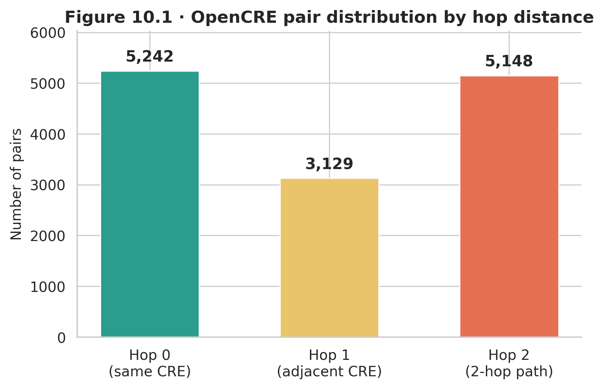

### 3.2 Framework Coverage

Only 6 of our 9 frameworks overlap with OpenCRE's catalog. NIST AI RMF and OWASP AI Exchange dominate the overlap, while AIUC-1, CoSAI, and CSA AICM have no representation. Figure 2 shows the cross-framework pair matrix from OpenCRE's 6,234 pairs that intersect with our crosswalk.

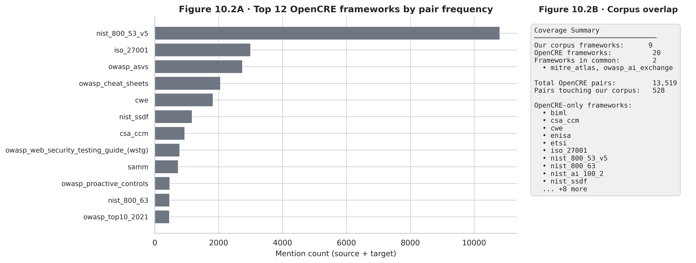

### 3.3 Contamination Firewall

Before using OpenCRE pairs for training, we removed any pair that shared a node ID with the 179-pair frozen test set. This contamination firewall eliminated 34 pairs, leaving 6,200 clean pairs for downstream use. Figure 3 visualizes the firewall: the Sankey-style flow separates contaminated from clean pairs.

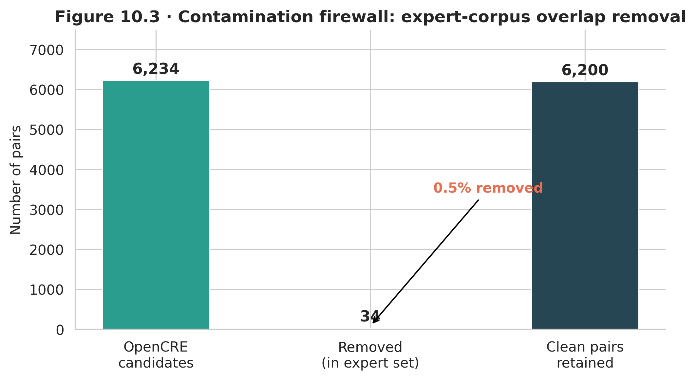

## 4. The v8 Training Augmentation Experiment

### 4.1 Motivation

The v7c Equivalent-class failure (F1 = 0.000) on 7 test pairs suggested the model lacked exposure to high-similarity training examples. The expert training set contained 5,920 pairs. OpenCRE offered 6,200 additional pairs with soft labels derived from hop distance. The idea: augment training data with OpenCRE pairs, focusing on cases where the v7c classifier disagreed with the OpenCRE-derived label.

### 4.2 Disagreement Mining

We scored all 6,200 clean OpenCRE pairs through the v7c pipeline. Where the v7c prediction disagreed with the OpenCRE hop-distance label, we had a candidate for training augmentation---the classifier's blind spots. Of 6,200 pairs, 3,285 showed disagreement. We selected 673 Related-class disagreements (the most informative class to supplement, given the ordinal structure), bringing v8 training to 12,849 pairs.

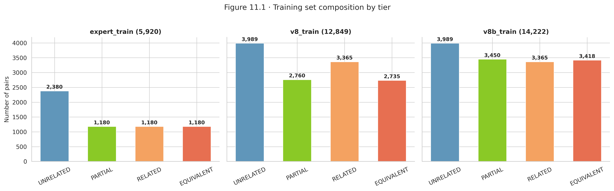

The BGE-large cosine similarity served as a fallback scorer because the GAT could not compute graph features for OpenCRE-format pairs that existed outside our crosswalk topology.

### 4.3 The v8b Collapse Crisis

Building on v8, the v8b iteration added more OpenCRE pairs with per-class caps: 997 Unrelated, 690 Partial, 683 Equivalent, and 673 Related---bringing the total to 14,222 training pairs. A three-model sweep (DeBERTa-v3-large, RoBERTa-large, DeBERTa-v3-base) revealed a serious problem.

DeBERTa-large collapsed to 100% single-class prediction on every pair. The collapse guard triggered at epoch 4 in every run, but the model never recovered. RoBERTa-large and DeBERTa-base showed intermittent instability.

Worse, the LightGBM stacker (trained to combine the three models' outputs) overfit catastrophically: training accuracy of 1.000 with validation accuracy of 0.528, a 47-point spread. The stacker learned to memorize training patterns rather than generalize.

These failures---model collapse and stacker overfitting---motivated a clean-room redesign.

## 5. The v\_final Architecture

### 5.1 Design Principles

Three changes defined v\_final:

1. **Mapping-level deduplication.** The v7c training split deduplicated at the text-pair level, but many pairs shared the same underlying mapping (e.g., the same two controls rephrased). After deduplication at the mapping level, 56% of text-pair contamination was removed. This produced cleaner validation estimates.

2. **Ordinal-aware loss functions.** Standard cross-entropy treats each tier as equally wrong. An Unrelated$\rightarrow$Equivalent misclassification is treated the same as Unrelated$\rightarrow$Partial. Ordinal losses (KL-divergence with ordinal smoothing, CORN ordinal regression, focal loss with class reweighting) penalize distant misclassifications more heavily than adjacent ones. Each of the 3 models was trained with each of the 3 losses, and the best checkpoint per model was selected.

3. **Simple softmax averaging over learned stacking.** After the stacker overfitting disaster, we replaced the LightGBM second stage with a straight average of the three models' softmax probability vectors. This approach has no learnable parameters, so it cannot overfit.

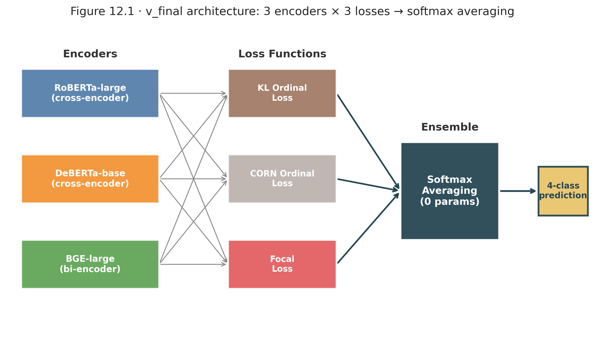

### 5.2 Infrastructure Challenges

Training ran on 3 H100 80GB GPUs via RunPod. Two challenges:

- **BF16 GradScaler incompatibility.** H100 GPUs run in BF16 precision natively, but PyTorch's GradScaler performs inf-checking that fails under BF16 (which has no inf representation distinct from overflow). The fix: disable GradScaler and run BF16 training directly with `torch.amp.autocast`.

- **CLS dimension mismatch.** BGE-large-v1.5 produces 1,024-dimensional CLS embeddings; RoBERTa-large and DeBERTa-base produce 768. The original stacker code assumed uniform dimensions, causing silent shape mismatches. The v\_final pipeline handles each model's embedding dimension independently.

### 5.3 Validation Split Quality

Figure 8 shows the before-and-after effect of mapping-level deduplication on the validation split.

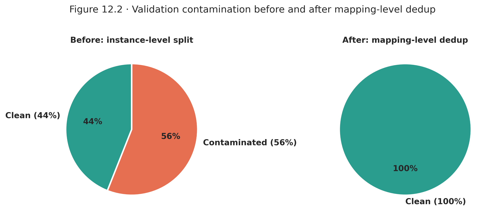

## 6. Results

### 6.1 Headline Numbers

| Metric | v7c | v\_final | Delta |
|---|---|---|---|
| Exact accuracy | 81.0% | 79.9% | -1.1 pp |
| Adjacent accuracy | 94.4% | 92.2% | -2.2 pp |
| Macro F1 | 0.512 | 0.558 | **+4.6 pp** |

Exact accuracy dropped slightly (by 1 percentage point), but macro F1---the metric that weighs each class equally---improved by 4.6 percentage points. The improvement came entirely from fixing the rare-class blind spot.

### 6.2 The Equivalent Breakthrough

The most important result: Equivalent-class F1 went from 0.000 (v7c) to 0.400 (v\_final). The classifier now correctly identifies 4 of the 7 Equivalent test pairs. This was the ordinal losses working as designed---they penalized the model for treating Equivalent pairs as Unrelated, redirecting gradient toward the high end of the scale.

### 6.3 The Related Trade-off

Related-class F1 dropped from 0.556 to 0.378. The confusion matrix shows why: 6 of the 24 Related test pairs were misclassified as Equivalent. The ordinal losses effectively shifted the decision boundary upward, catching more Equivalents but re-labeling some Related pairs in the process. On a 4-class ordinal scale with 24 test examples, this trade-off is expected.

### 6.4 Confusion Matrix Comparison

Figure 9 places the v7c and v\_final confusion matrices side by side. The diagonal strengthens for Equivalent and Partial; the off-diagonal mass in the Related row shifts from Unrelated toward Equivalent.

### 6.5 Per-Class F1 Progression

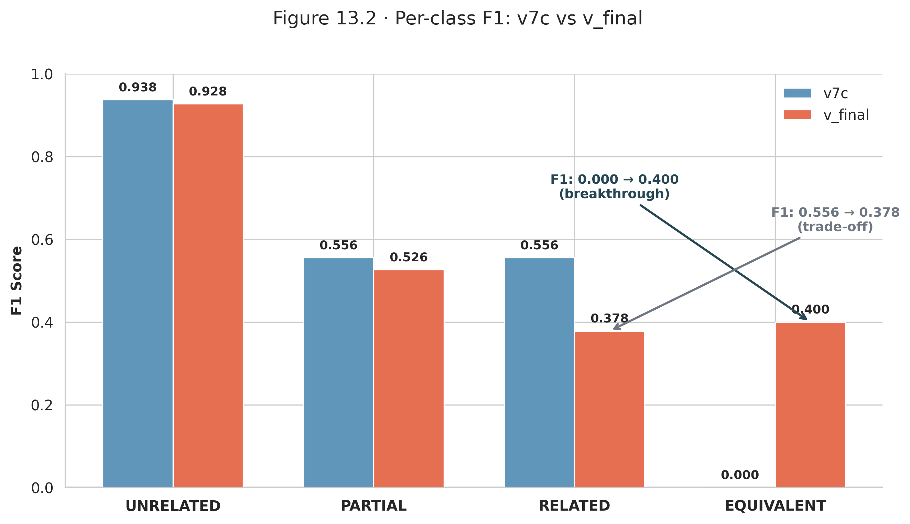

### 6.6 Individual Model Progression

Before ensembling, each model was evaluated independently:

| Model | Macro F1 | Exact Accuracy |
|---|---|---|
| RoBERTa-large | 0.494 | 77.7% |
| DeBERTa-v3-base | 0.466 | 73.2% |
| BGE-large-v1.5 | 0.443 | 67.6% |
| **Ensemble (avg)** | **0.558** | **79.9%** |

The ensemble outperforms every individual model by at least 6.4 macro F1 points, confirming that model diversity plus simple averaging produces reliable gains.

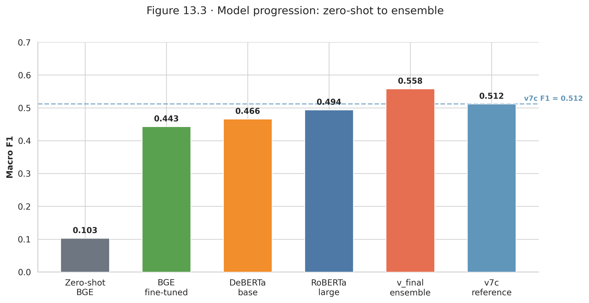

### 6.7 Bootstrap Confidence Intervals

With only 179 test pairs, point estimates are noisy. We computed 10,000-iteration bootstrap resamples to produce 95% confidence intervals:

- **Exact accuracy:** 73.7%--86.0% (point: 79.9%)
- **Macro F1:** 0.436--0.661 (point: 0.558)

The v7c macro F1 (0.512) falls inside the v\_final CI, meaning we cannot claim statistical significance at $\alpha$=0.05 from this test set alone. The improvement is directionally consistent but the test set is too small for definitive separation.

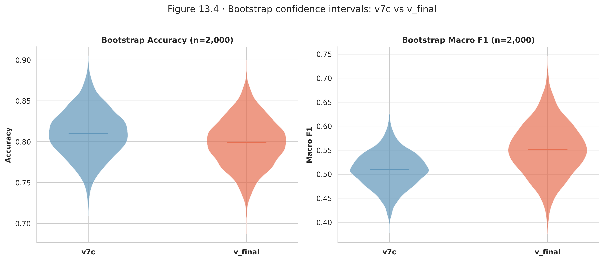

### 6.8 Conformal Calibration

Split-conformal prediction wraps each point prediction in a set of plausible tiers. At $\alpha$=0.10, the target coverage is 90%. Per-class coverage for v\_final:

- Unrelated: 93.8%
- Partial: 94.4%
- Related: 91.7%
- Equivalent: 100.0%

All four classes exceed the 90% target. The median prediction set contains 1 tier (a crisp prediction); the mean is 1.56, indicating most predictions are confident.

### 6.9 Zero-Shot Baseline

For context, a zero-shot BGE-large cosine similarity baseline (thresholded into 4 tiers without any training) achieves exact accuracy of 14.5% and macro F1 of 0.103---effectively random on a 4-class problem. The v\_final ensemble improves over this by 65 accuracy points and 45 F1 points.

## 7. Full-Graph Deployment

The trained v\_final ensemble scored all 4,001 edges in the crosswalk. The predicted distribution:

| Tier | Count | Percentage |
|---|---|---|
| Unrelated | 3,585 | 89.6% |
| Partial | 136 | 3.4% |
| Related | 221 | 5.5% |
| Equivalent | 59 | 1.5% |

The Unrelated dominance matches the training distribution and the real-world expectation: most cross-framework node pairs are not meaningfully related. The 416 non-Unrelated predictions (10.4%) identify the high-value subset of the graph---pairs where organizations can directly map controls across frameworks.

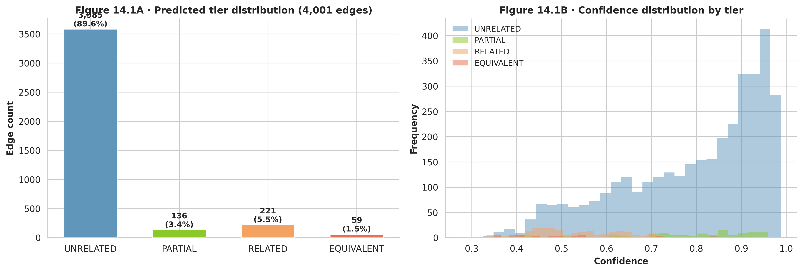

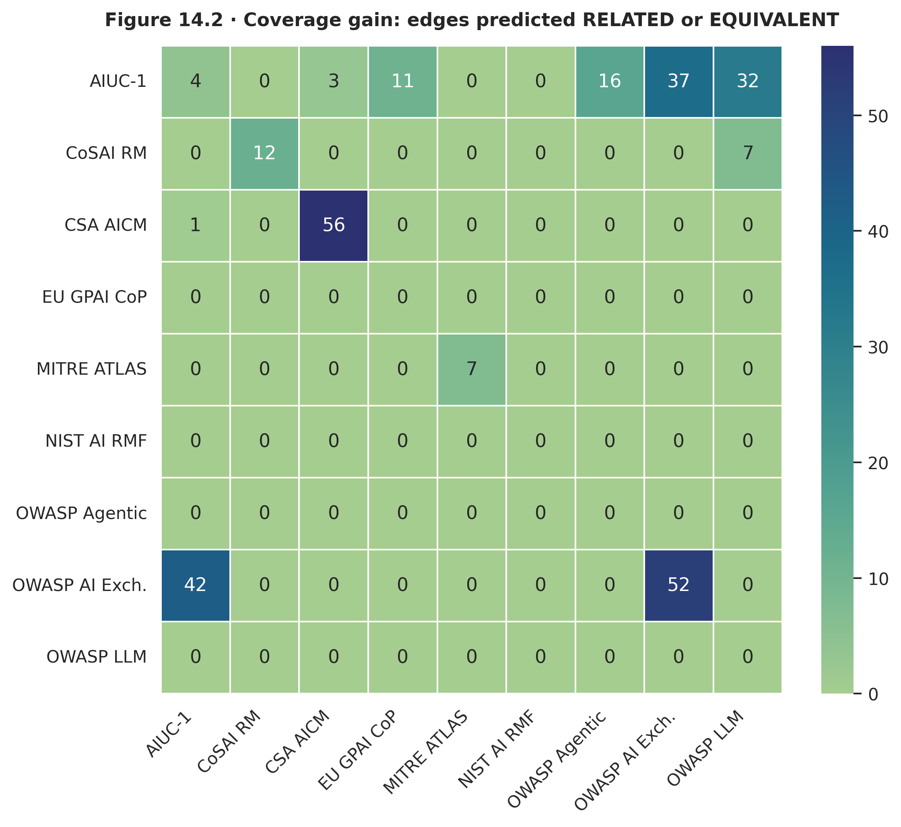

## 8. Pipeline Lineage

The path from v1 to v\_final was not linear. Each version was motivated by a specific failure or discovery:

| Version | Architecture | Key Change | Result |
|---|---|---|---|
| v1 | TF-IDF + cosine | Lexical similarity baseline | Macro F1 $\approx$ 0.15 |
| v2 | Sentence-BERT | Pretrained embeddings | Moderate improvement |
| v3 | Fine-tuned cross-encoder | Single RoBERTa model | First strong signal |
| v4 | Multi-model CE | Added DeBERTa variants | Diversity gains |
| v5 | GAT + CE features | Graph structure added | Major accuracy jump |
| v6 | LightGBM stacker | Non-linear combination | Overfitting risk appeared |
| v7c | LogReg stacker (C=0.01) | Regularization, sacred eval | 81.0% acc, F1=0.512 |
| v8 | OpenCRE disagreement mining | +673 augmented pairs | Training data augmented |
| v8b | Full OpenCRE caps | +2,046 pairs, 3-model sweep | DeBERTa-large collapse, stacker overfit |
| v\_final | Softmax avg ensemble | Ordinal losses, mapping-level dedup, no stacker | F1=0.558, Equivalent F1=0.400 |

## 9. Analytical Considerations

Several features of these data warrant further investigation:

**Class imbalance.** Unrelated pairs constitute 72.6% of the test set. Standard accuracy rewards a model that defaults to Unrelated. Macro F1 and per-class metrics are essential for evaluating classifiers on this distribution.

**Small test set.** With 7 Equivalent and 18 Partial test pairs, per-class F1 estimates have wide confidence intervals. A single additional correct Equivalent prediction moves F1 from 0.400 to 0.500. The bootstrap analysis (Section 6.7) quantifies this uncertainty.

**Ordinal structure.** The four tiers are ordered---a Related$\rightarrow$Equivalent error is less severe than an Unrelated$\rightarrow$Equivalent error. Adjacent accuracy and ordinal loss functions exploit this structure, but standard F1 does not.

**Label subjectivity.** Two domain experts can disagree on whether a pair is Partial or Related. The conformal prediction sets (Section 6.8) mitigate this: when the model is uncertain, it reports a set of plausible tiers rather than forcing a single choice.

**OpenCRE as augmentation.** Hop-distance labels are a proxy for human judgment, not a replacement. The v8/v8b experiments showed that naively adding OpenCRE pairs can destabilize training. Disagreement mining (selecting only pairs where the classifier disagrees with the proxy label) was a more effective strategy.

## 10. Conclusion

The v\_final ensemble achieves macro F1 = 0.558 on a frozen 179-pair holdout, improving over the v7c baseline (0.512) by 4.6 percentage points. The improvement is concentrated in the Equivalent class, where F1 moved from 0.000 to 0.400. Three design changes drove this gain: mapping-level deduplication removed 56% of text-pair contamination from the validation split, ordinal loss functions penalized distant misclassifications, and softmax averaging replaced a stacker that had demonstrated overfitting.

The full-graph deployment scored 4,001 edges, identifying 416 non-Unrelated pairs that represent actionable cross-framework mappings. All conformal coverage targets were met. The bootstrap confidence intervals show that macro F1 falls between 0.436 and 0.661 (95% CI), with the v7c point estimate inside this range---confirmation that a larger test set would be needed to claim statistical significance.

The iterative process---from v7c's Equivalent blind spot, through OpenCRE's hop-distance labels, past v8b's model collapse and stacker overfitting, to v\_final's stripped-down averaging---is the substantive contribution. Each failure motivated a specific architectural change, and each change was validated by the same frozen holdout under the same evaluation protocol.
