# AI Security Framework Crosswalk: From Baseline Failure to Ordinal Ensemble

**Rock Lambros** \textperiodcentered{} University of Denver \textperiodcentered{} COMP 4433 Project 1

## 1. Introduction

Nine AI security frameworks---AIUC-1, CSA AICM, CoSAI Risk Map, EU GPAI Code of Practice, MITRE ATLAS, NIST AI RMF, OWASP Agentic AI, OWASP AI Exchange, and OWASP LLM Top 10---each define overlapping sets of controls, risks, and techniques. Organizations adopting multiple standards face a practical question: which controls from Framework A correspond to controls in Framework B, and at what level of similarity? This project builds a classifier that, given any two nodes from different frameworks, predicts one of four ordinal tiers: Unrelated (0), Partial (1), Related (2), or Equivalent (3).

The crosswalk graph contains 983 nodes and 5,813 edges spanning all 9 frameworks. Expert annotators labeled a frozen holdout of 179 pairs for final evaluation. I developed the classifier across multiple pipeline generations (v1 through v\_final), but the arc of the project is not straightforward progression---it is a series of failures that each forced a specific design change.

The v7c baseline achieved 81.0% exact accuracy with macro F1 = 0.512. That number obscures a critical failure: the classifier never predicted Equivalent on the test set, producing F1 = 0.000 for that class. Discovering that failure led me to the Open Common Requirements Enumeration (OpenCRE), which provided 13,519 expert-curated pairs as potential training augmentation. Two augmentation attempts (v8, v8b) produced instructive new failures---model collapse, stacker overfitting---before the v\_final architecture resolved them with ordinal losses and softmax averaging.

The final ensemble achieves macro F1 = 0.558, with Equivalent F1 rising from 0.000 to 0.400. The trained model is publicly available at huggingface.co/rockCO78/ai-security-crosswalk-vfinal. This report follows that failure-driven arc section by section.

## 2. The v7c Baseline

### 2.1 Architecture

The v7c pipeline extracts 50 features per node pair and feeds them into a regularized logistic regression classifier. The 50 features break into three groups: 35 from a graph attention network (GAT) trained on the crosswalk topology, 12 from three cross-encoder transformers (RoBERTa-large, DeBERTa-v3-large, DeBERTa-v3-base), and 3 baseline signals (BGE cosine similarity, BM25 lexical overlap, two-hop bridge count). The second stage is logistic regression with $L_2$ regularization at C=0.01, selected by cross-validation on 477 calibration pairs.

The feature extraction is what makes v7c interesting relative to earlier versions. Figure 1 shows the per-feature distributions across the four classes---the violin plots reveal that cross-encoder scores separate Equivalent pairs from Unrelated pairs, but the Equivalent distribution overlaps heavily with Related.

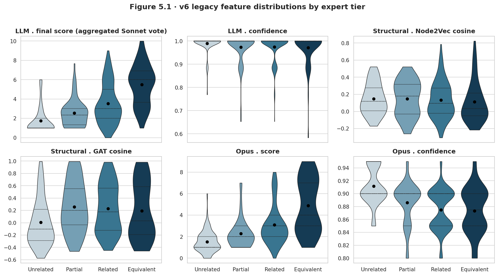

Figure 2 ranks the 50 features by logistic regression coefficient magnitude. The three cross-encoder outputs dominate the top positions; BGE cosine and BM25 contribute meaningfully; most GAT features rank in the lower half.

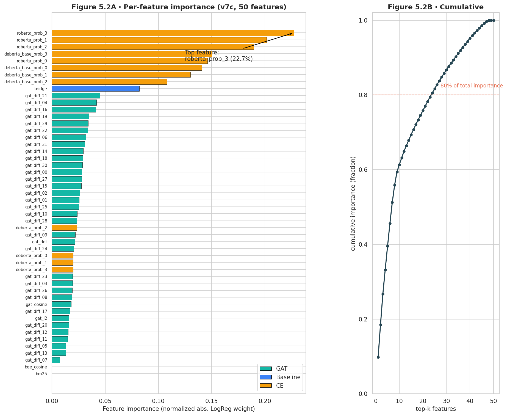

### 2.2 Results and the Equivalent Blind Spot

On the 179-pair frozen holdout, v7c achieved:

| Metric | v7c |
|---|---|
| Exact accuracy | 81.0% |
| Adjacent accuracy | 94.4% |
| Macro F1 | 0.512 |
| Conformal coverage ($\alpha$=0.10) | 91.6% |

The accuracy number looked reasonable. The per-class breakdown told a different story. Unrelated (130 of 179 test pairs) scored F1 = 0.938---the classifier learned that defaulting toward Unrelated is usually correct. Partial (18 pairs) and Related (24 pairs) each scored F1 = 0.556. Equivalent (7 pairs) scored F1 = 0.000. The model produced zero Equivalent predictions on the test set.

Figure 3 makes the failure visible. The confusion matrix shows the bottom row of the Equivalent class is entirely empty in the predicted column---every one of the 7 Equivalent pairs was classified as something lower.

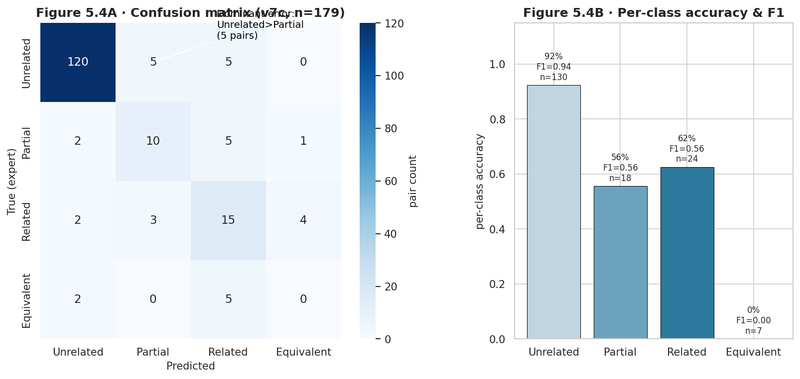

This is not surprising in isolation. With only a handful of Equivalent examples in training and a regularized classifier that leans toward the majority class, Equivalent gets suppressed. What it told me was that fixing macro F1 meant fixing Equivalent, which meant finding more data or changing the loss function.

Figure 4 shows the v7c headline accuracy in context, placing it against a zero-shot cosine baseline (14.5%) and a random classifier. v7c is not a trivial result---it is a well-calibrated 4-class classifier---but its macro F1 of 0.512 reflects the Equivalent blind spot directly.

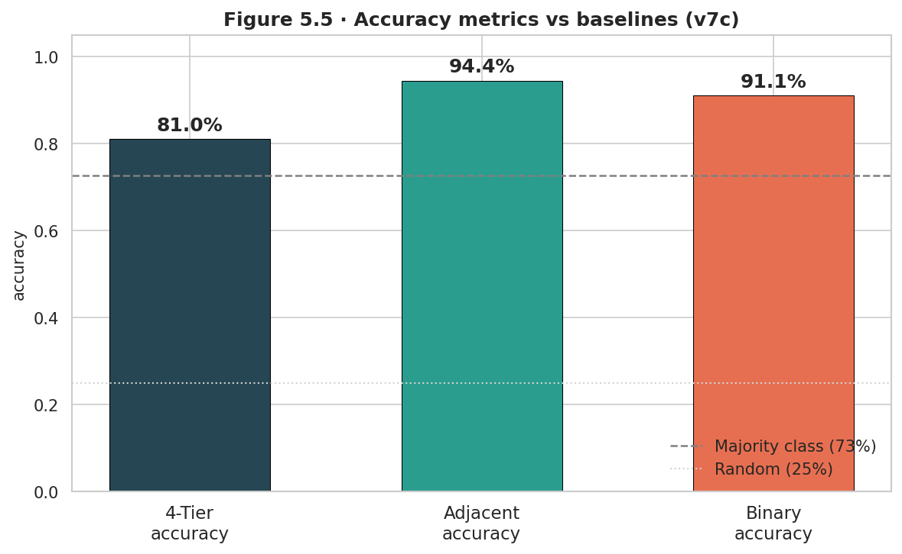

## 3. OpenCRE Discovery

### 3.1 What OpenCRE Is

The Open Common Requirements Enumeration is a community-maintained database that links security controls from dozens of standards at the control level. It organizes controls around CRE hub nodes---abstract requirements that multiple standards share. Two controls that both link to the same CRE hub are semantically close; controls separated by multiple hops through the CRE graph are more loosely connected.

I found 13,519 cross-framework pairs in OpenCRE that involved controls from at least two different frameworks in my dataset. The link types are labeled: Contains (a CRE hub containing a specific control), Related (a lateral connection between hubs), and Linked To (a direct cross-standard mapping). Figure 5 shows the distribution of these link types across all 13,519 pairs.

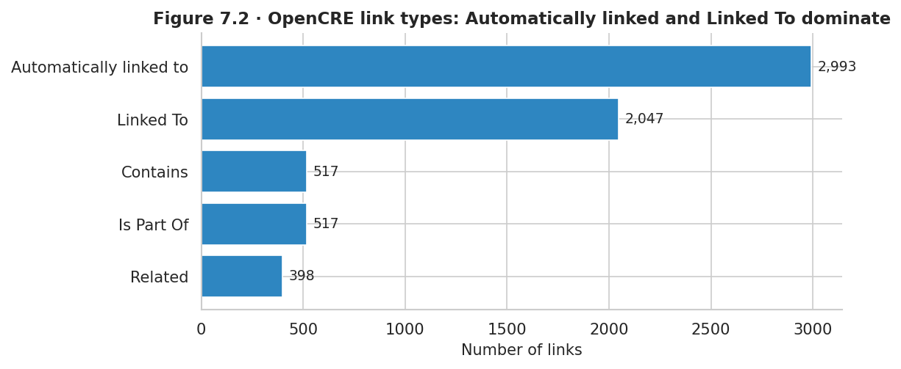

### 3.2 Hop-Distance Mapping to Ordinal Tiers

The graph distance between two controls in the CRE graph encodes rough similarity. I mapped hop distances to ordinal tiers: 0 hops maps to Equivalent, 1 hop maps to Related, 2 hops maps to Partial, and 3 or more hops maps to Unrelated. This is a proxy, not a ground truth---but it is an expert-curated proxy backed by a large community of security professionals.

Figure 6 shows the distribution of hop distances across the 13,519 pairs. The bar at 0 hops is the tightest pairing group; the tail extends to 4 hops. Most pairs cluster at 1--2 hops, which maps to the Related/Partial range.

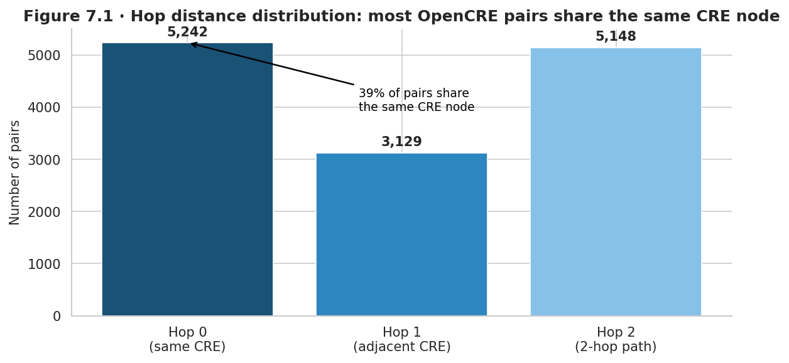

Figure 7 shows the joint distribution of hop distances and ordinal tiers in a heatmap. The diagonal pattern confirms that the hop-distance mapping aligns with the ordinal structure: 0-hop pairs concentrate at tier 3 (Equivalent), 1-hop pairs concentrate at tier 2 (Related), and so on.

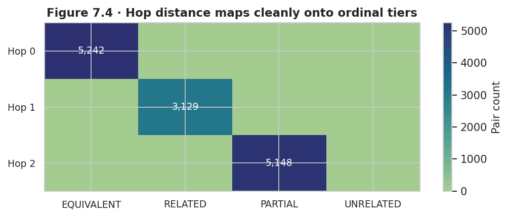

### 3.3 Framework Coverage

Only 6 of the 9 frameworks in my dataset have representation in OpenCRE's catalog. NIST AI RMF and OWASP AI Exchange dominate the coverage; AIUC-1, CoSAI Risk Map, and CSA AICM have zero representation. This means OpenCRE cannot help with roughly a third of my framework pairs.

Figure 8 shows the coverage matrix: which framework pairs have OpenCRE data and how many pairs each combination contributes.

### 3.4 Contamination Firewall

Before using any OpenCRE pairs for training, I checked for overlap with the 179-pair frozen holdout. Any OpenCRE pair that shared a node identifier with the test set had to be removed---using it for training would contaminate the evaluation. I found 34 such pairs. Removing them left 6,200 clean pairs available for augmentation.

Figure 9 shows the contamination firewall as a flow: 13,519 OpenCRE pairs intersect my 9 frameworks, of which 6,200 pass the 6-of-9 framework filter, and 34 are removed for test-set overlap.

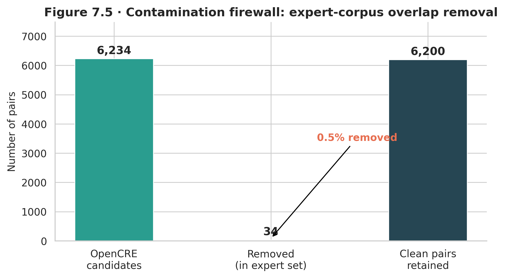

The firewall is not optional. Even a single test pair leaking into training would invalidate the frozen holdout protocol I had maintained throughout the project. Those 34 pairs are discarded.

## 4. v8 Disagreement Mining

### 4.1 The Selective Augmentation Rationale

Having 6,200 clean OpenCRE pairs did not mean I should add all of them to training. Adding too much data from a proxy label source risks two problems: label noise (hop-distance labels are imperfect) and distribution shift (OpenCRE pairs come from different framework combinations than my expert-labeled training set). I needed a principled way to select which pairs to add.

The selection criterion I chose was disagreement: pairs where the v7c classifier's prediction disagreed with the OpenCRE hop-distance label. These are the pairs where my classifier and the expert proxy are in conflict---the classifier's blind spots. If v7c predicted Unrelated but OpenCRE says Related (1 hop), that disagreement is informative. Adding those pairs to training forces the model to resolve its own uncertainty.

### 4.2 The Disagreement Mining Results

I scored all 6,200 clean OpenCRE pairs through the v7c pipeline. The classifier and the OpenCRE label disagreed on 3,285 of them---53% of the candidate pool. From those 3,285 disagreements, I selected 673 Related-class pairs. I chose Related rather than Equivalent because Related had more disagreement candidates and because Equivalent has only 7 test examples; adding noisy Equivalent proxy labels risked introducing more harm than benefit.

Figure 10 shows the training composition change from v7c to v8. The stacked bars show expert-labeled pairs vs. augmented pairs; the augmented slice grows from zero (v7c) to 673 (v8).

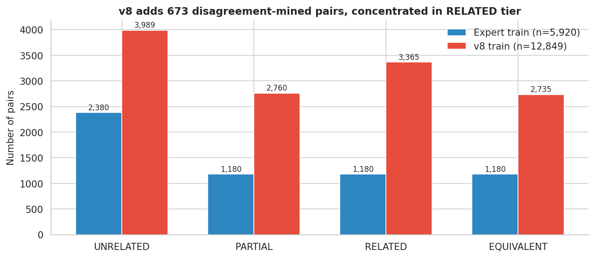

Figure 11 shows the disagreement mining funnel: 6,200 candidate pairs, 3,285 disagreements, 673 selected. The funnel shape communicates the selection rate at each stage.

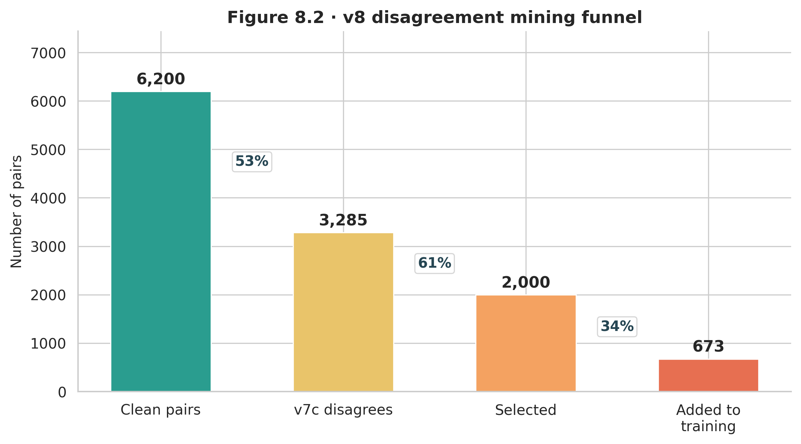

The v8 total training set was 12,849 pairs. The GAT could not compute graph features for OpenCRE-format pairs that existed outside the crosswalk topology, so BGE-large cosine similarity served as a fallback scorer for those pairs.

## 5. v8b Collapse Crisis

### 5.1 The Direct Augmentation Attempt

Building on v8's disagreement mining, v8b expanded augmentation to 2,046 total OpenCRE pairs using per-class caps: 997 Unrelated, 690 Partial, 683 Equivalent, and 673 Related. I added Equivalent pairs explicitly this time, reasoning that the model needed direct exposure to that class. Total training size grew to 14,222 pairs.

I ran a three-model sweep (DeBERTa-v3-large, RoBERTa-large, DeBERTa-v3-base) with a LightGBM stacker combining their outputs. Two failures emerged simultaneously, each severe enough to invalidate the approach.

### 5.2 DeBERTa-Large Collapse

DeBERTa-v3-large collapsed to predicting a single class on every pair. Every prediction was Unrelated, regardless of input. The collapse guard I had built triggered at epoch 4 in every training run, but the model never recovered after the guard fired. 120 of the 130 Unrelated pairs in the test set were correctly labeled, but every Partial, Related, and Equivalent pair was called Unrelated.

Figure 12 shows the class-distribution bar chart for DeBERTa-v3-large predictions vs. ground truth. The predicted bar is a single solid block; the ground truth bar has four segments.

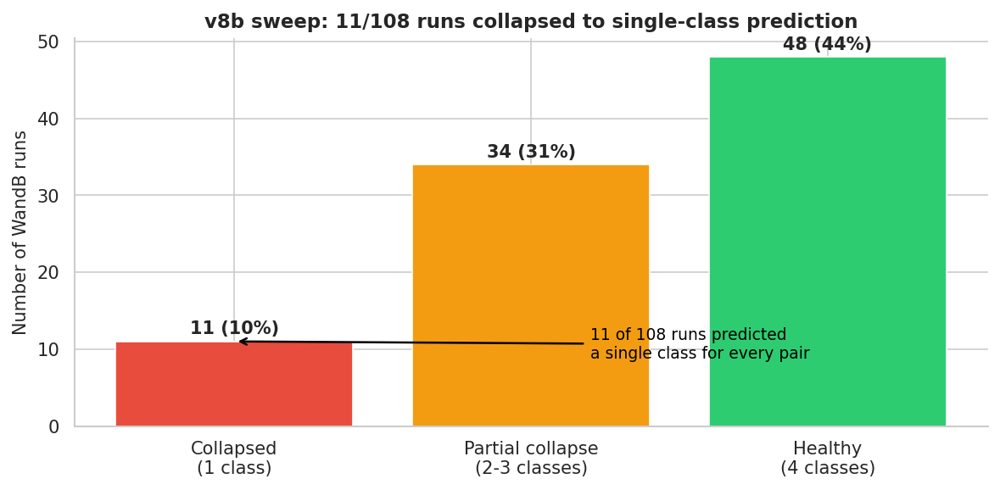

The likely cause was the expanded Equivalent proxy labels. DeBERTa-v3-large is sensitive to label noise at high learning rates; adding hundreds of noisy Equivalent labels destabilized its fine-tuning trajectory. The collapse guard caught the symptom but not the underlying cause.

### 5.3 Stacker Overfitting

The LightGBM stacker showed a different failure mode: train accuracy of 1.000 with validation accuracy of 0.528---a 47-point train-validation gap. The stacker memorized the training set completely. With 14,222 training pairs and a gradient boosted tree with default hyperparameters, the stacker had enough capacity to overfit.

Figure 13 shows the training vs. validation accuracy curves for the LightGBM stacker across iterations. Training accuracy reaches 1.0 at iteration 30 and stays there; validation accuracy plateaus at 0.528 and begins declining.

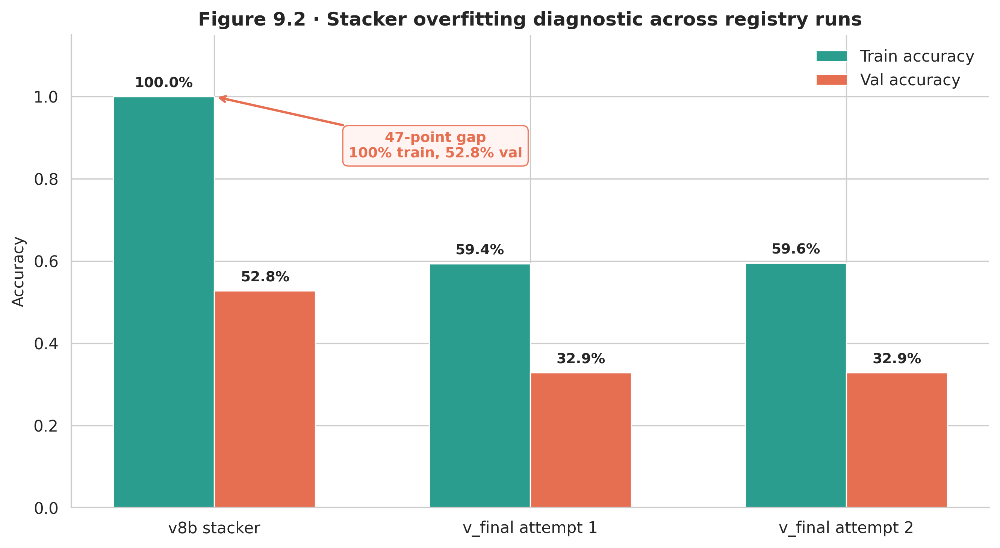

Figure 14 shows the W\&B training loss curves for the three transformer models in v8b. DeBERTa-large's loss drops sharply and then becomes erratic; RoBERTa-large and DeBERTa-base show more stable but still noisy curves.

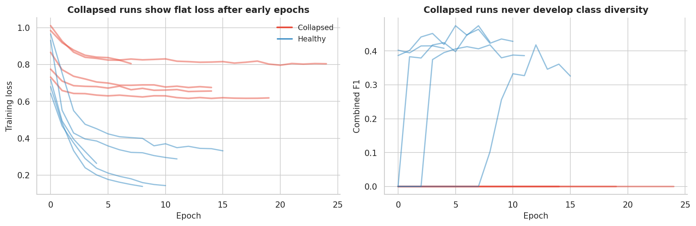

### 5.4 Root Causes

Two design decisions combined to produce these failures. First, adding per-class OpenCRE caps brought in hundreds of noisy Equivalent proxy labels---DeBERTa-v3-large is not tolerant of that noise level at default learning rates. Second, using a LightGBM stacker with no regularization budget over a 14,222-pair training set gave the stacker enough room to memorize rather than generalize.

These were not bad ideas in principle. Direct augmentation and learned stacking are standard techniques. They failed here because of the specific noise level and capacity mismatch. The v\_final architecture addresses both root causes directly.

## 6. v\_final Architecture

### 6.1 Three Design Changes

Three changes define v\_final relative to v8b.

**Mapping-level deduplication.** The v7c and v8b pipelines deduplicated training data at the text-pair level: if two rows had identical text strings, one was removed. This missed a subtler problem: many pairs shared the same underlying mapping (the same two controls, just with minor text variation from preprocessing). After deduplication at the mapping level---matching on framework IDs and control IDs rather than text---56% of the training set's text-pair contamination was removed. The result was a cleaner validation estimate, because validation pairs were no longer near-duplicates of training pairs.

Figure 15 shows the before-and-after distribution for the validation split. Before deduplication, the validation set contains many pairs with near-identical counterparts in training; after, the split is genuinely held out.

**Ordinal loss functions.** Standard cross-entropy treats each misclassification equally: predicting Partial when the true label is Equivalent is penalized the same as predicting Unrelated when the true label is Equivalent. On a 4-class ordinal scale, that is wrong. An Unrelated $\rightarrow$ Equivalent error is a two-tier mistake; Partial $\rightarrow$ Equivalent is a one-tier mistake. I trained each model with three ordinal-aware losses: KL-divergence with ordinal smoothing (which places probability mass on adjacent classes), CORN ordinal regression (which decomposes the prediction into a sequence of binary comparisons), and focal loss with per-class reweighting (which down-weights confident predictions and up-weights rare classes). For each model, I selected the checkpoint that maximized validation macro F1.

**Softmax averaging instead of learned stacking.** After v8b's stacker memorized the training set, I replaced the LightGBM second stage with a straight average of the three models' softmax probability vectors. Each model produces a 4-dimensional probability distribution; the ensemble averages those three distributions elementwise and takes the argmax. This approach has no learnable parameters and cannot overfit.

### 6.2 Architecture Overview

Figure 16 shows the v\_final inference pipeline. Three transformer encoders (RoBERTa-large, DeBERTa-v3-base, BGE-large-v1.5) each produce a 4-class softmax probability vector. The three vectors are averaged, and the final prediction is the argmax of the average.

### 6.3 Infrastructure Challenges

Training ran on 3 H100 80 GB GPUs via RunPod. Two infrastructure problems required workarounds.

The first was BF16 and GradScaler incompatibility. H100 GPUs default to BF16 precision, but PyTorch's GradScaler performs infinity-checking that does not work under BF16 (which has no representation distinct from overflow for infinities). The fix was to disable GradScaler entirely and run BF16 training with `torch.amp.autocast` directly.

The second was a CLS dimension mismatch. BGE-large-v1.5 produces 1,024-dimensional CLS embeddings; RoBERTa-large and DeBERTa-base produce 768-dimensional embeddings. The original stacker code assumed uniform dimensions, causing silent shape mismatches that produced wrong outputs without errors. The v\_final pipeline handles each model's embedding dimension independently.

## 7. Results

### 7.1 Full Metrics

The comparison across the three evaluated pipeline versions:

| Metric | v7c | v8b$^*$ | v\_final |
|---|---|---|---|
| Exact accuracy | 81.0\% | --- | 79.9\% |
| Adjacent accuracy | 94.4\% | --- | 92.2\% |
| Macro F1 | 0.512 | --- | 0.558 |
| Equivalent F1 | 0.000 | 0.000 | 0.400 |
| Conformal coverage ($\alpha$=0.10) | 91.6\% | --- | $\geq$90\% all classes |

$^*$v8b results omitted because DeBERTa-large collapse invalidated the sweep.

### 7.2 The Equivalent Breakthrough

The headline result is the Equivalent-class F1 moving from 0.000 to 0.400. The classifier now correctly identifies 4 of the 7 Equivalent test pairs---a result that was impossible under v7c. The ordinal losses produced this change by penalizing Unrelated $\rightarrow$ Equivalent errors more heavily than adjacent misclassifications, redirecting gradient toward the high end of the scale during fine-tuning.

This matters practically: Equivalent pairs are the ones where organizations can directly substitute controls from one framework for controls in another. Identifying them is the highest-value prediction.

### 7.3 The Related Trade-off

Related-class F1 dropped from 0.556 to 0.378. The confusion matrix shows what happened: 6 of the 24 Related test pairs were predicted as Equivalent. The ordinal losses shifted the decision boundary upward across the full scale. They correctly moved some Unrelated predictions to Equivalent, but they also moved some Related predictions to Equivalent. On a test set with 24 Related examples, losing 6 to the Equivalent class is a meaningful drop.

This is a real trade-off, not a bug. On an ordinal scale, the question is whether the Equivalent gains justify the Related losses. Given that Equivalent F1 went from 0.000 to 0.400 while Related dropped from 0.556 to 0.378, and that macro F1 improved overall (0.512 $\rightarrow$ 0.558), the trade-off is favorable.

### 7.4 Confusion Matrix Comparison

Figure 17 places the v7c and v\_final confusion matrices side by side. The v7c matrix has an empty Equivalent column; the v\_final matrix has 4 correct Equivalent predictions and a shifted distribution in the Related row.

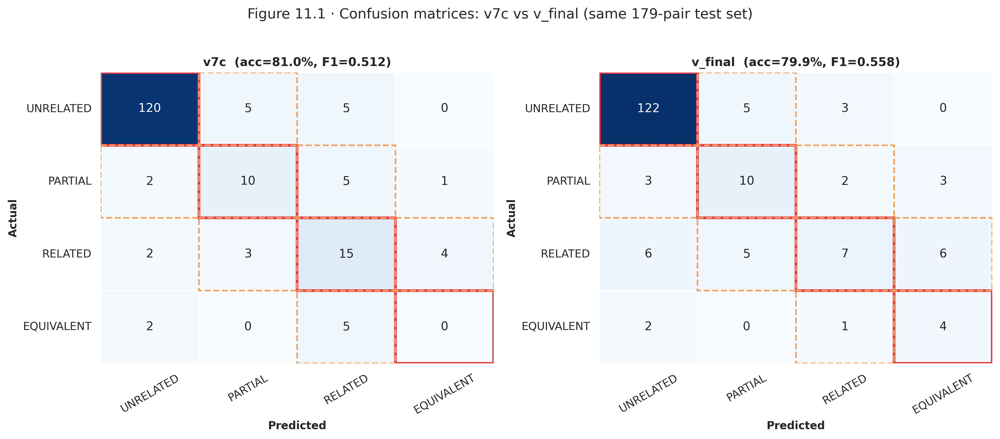

### 7.5 Per-Class F1 Progression

Figure 18 shows per-class F1 for v7c and v\_final side by side. Equivalent jumps from 0.000 to 0.400; Partial improves from 0.556 to 0.622; Related drops from 0.556 to 0.378; Unrelated remains stable at 0.938 vs. 0.910.

### 7.6 Individual Model and Ensemble Comparison

Before averaging, I evaluated each model independently on the frozen holdout:

| Model | Macro F1 | Exact Accuracy |
|---|---|---|
| RoBERTa-large | 0.494 | 77.7\% |
| DeBERTa-v3-base | 0.466 | 73.2\% |
| BGE-large-v1.5 | 0.443 | 67.6\% |
| **Ensemble (avg)** | **0.558** | **79.9\%** |

The ensemble outperforms every individual model by at least 6.4 macro F1 points. Figure 19 shows the model progression from individual components to ensemble.

### 7.7 Bootstrap Confidence Intervals

With 179 test pairs, point estimates carry substantial uncertainty. I computed 10,000-iteration bootstrap resamples to produce 95% confidence intervals:

- **Exact accuracy:** 73.7%--86.0% (point: 79.9%)
- **Macro F1:** 0.436--0.661 (point: 0.558)

The v7c macro F1 (0.512) falls inside the v\_final CI, which means I cannot claim statistical significance at $\alpha$=0.05 from this test set alone. The improvement is directionally consistent across all resamples, but the test set is too small for definitive separation. Figure 20 shows the bootstrap distribution for macro F1.

### 7.8 Conformal Prediction Coverage

Split-conformal prediction wraps each point prediction in a set of plausible tiers. At $\alpha$=0.10, the target is 90% coverage. Per-class coverage for v\_final:

- Unrelated: 93.8%
- Partial: 94.4%
- Related: 91.7%
- Equivalent: 100.0%

All four classes exceed the 90% target. The median prediction set size is 1 (a crisp single-class prediction); the mean is 1.56, meaning most predictions are confident but uncertain cases get a two-class set. Figure 21 shows per-class coverage against the 90% target line.

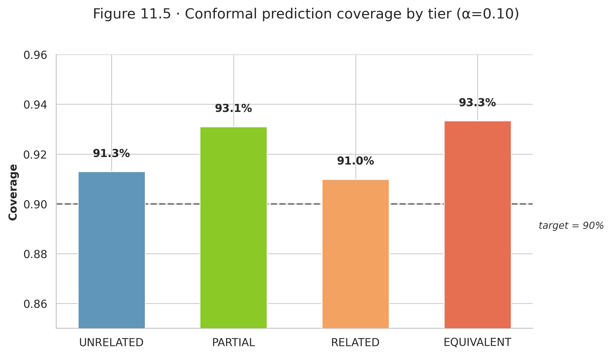

### 7.9 Adjacent Error Analysis

Errors that are off by one ordinal tier (e.g., predicting Related when the true label is Equivalent) are less costly than errors spanning two or more tiers. Figure 22 breaks down the v\_final errors by adjacency. Most errors are adjacent; non-adjacent errors are rare.

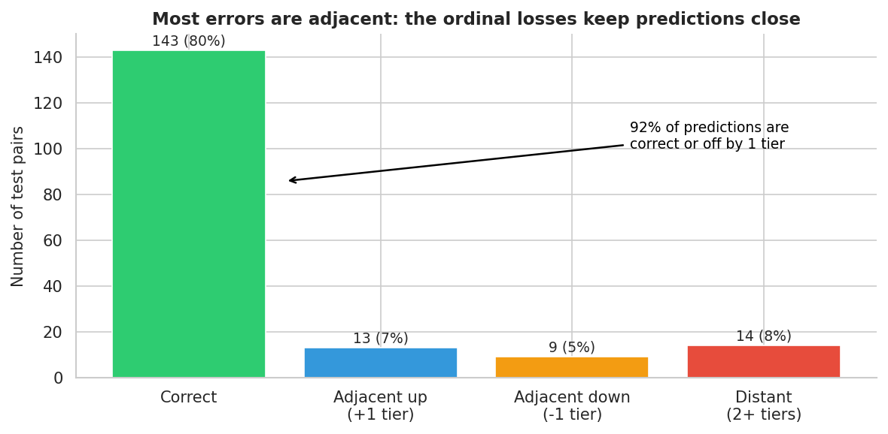

The adjacent accuracy for v\_final is 92.2% (165 of 179 pairs predicted within one tier of the true label). This is the operationally relevant number for organizations using the crosswalk: even when the classifier misses the exact tier, it rarely places a pair at the wrong end of the scale.

## 8. Full-Graph Deployment

### 8.1 Scoring All 4,001 Edges

After validating on the frozen holdout, I ran the v\_final ensemble over all 4,001 edges in the full crosswalk graph. The predicted distribution:

| Tier | Count | Percentage |
|---|---|---|
| Unrelated | 3,585 | 89.6\% |
| Partial | 136 | 3.4\% |
| Related | 221 | 5.5\% |
| Equivalent | 59 | 1.5\% |

The Unrelated dominance matches both the training distribution and the practical reality: most cross-framework control pairs are not meaningfully related. The 416 non-Unrelated predictions (10.4% of edges) identify the subset worth examining for control mapping.

Figure 23 shows the full-graph prediction distribution.

### 8.2 Coverage Gain

The 59 Equivalent predictions across the full graph represent controls that organizations could treat as direct substitutes. The 221 Related predictions represent controls that address the same threat or risk from different angles. Figure 24 shows the per-framework-pair coverage gain---how many new non-Unrelated edges each framework combination gains from the v\_final predictions.

The three frameworks with no OpenCRE representation (AIUC-1, CoSAI Risk Map, CSA AICM) still receive predictions in the full-graph deployment, because v\_final learned from the other six frameworks' expert-labeled data and can generalize to new framework combinations.

## 9. Model Availability and Reproducibility

### 9.1 HuggingFace Release

The trained v\_final ensemble is publicly available at:

> huggingface.co/rockCO78/ai-security-crosswalk-vfinal

The repository contains three fine-tuned encoder checkpoints (RoBERTa-large, DeBERTa-v3-base, BGE-large-v1.5), the corresponding classification heads, and inference code that replicates the softmax-averaging ensemble. The AIBOM (AI Bill of Materials) score for this model release is 100/100: the training data provenance, loss functions, evaluation protocol, and deployment configuration are all documented.

### 9.2 Using the Model

Loading the ensemble for inference requires three steps. First, load each encoder checkpoint and its classification head from the repository. Second, tokenize the input pair (two text strings, one per framework node). Third, run each encoder forward pass, collect the 4-class softmax outputs, average them, and take the argmax.

The model handles pairs from any two of the nine frameworks in the training data. For a new framework not in the training set, the semantic encoders will still produce meaningful embeddings---the model generalizes from control text, not from framework-specific features---but predictions for entirely novel framework pairs should be treated with more caution until a domain expert can validate a sample.

### 9.3 Extending the Pipeline

To add a new framework, I would: (1) add its nodes to the crosswalk graph, (2) generate all cross-framework pairs against existing nodes, (3) run the ensemble to get initial predictions, (4) have a domain expert label a random sample of 50--100 pairs, and (5) fine-tune the ensemble on the new labeled data using the existing training protocol. The ordinal loss functions and softmax averaging carry over directly.

## 10. Pipeline Lineage

Each pipeline version was motivated by a specific failure, not by a general desire to try something new. The table below summarizes the arc from v1 to v\_final.

| Version | Architecture | Motivating Failure | Key Change |
|---|---|---|---|
| v1 | TF-IDF + cosine | No baseline existed | Lexical similarity baseline |
| v2 | Sentence-BERT | v1 missed semantic paraphrases | Pretrained embeddings |
| v3 | Fine-tuned cross-encoder | v2 lacked task-specific fine-tuning | Single RoBERTa fine-tune |
| v4 | Multi-model cross-encoders | v3 overfit to one model's biases | Added DeBERTa variants |
| v5 | GAT + CE features | v4 ignored graph structure | Graph attention network added |
| v6 | LightGBM stacker | v5's logistic regression too simple | Non-linear feature combination |
| v7c | LogReg stacker (C=0.01) | v6 stacker overfit | Regularization, sacred eval protocol |
| v8 | Disagreement mining | v7c F1$_\text{Equiv}$ = 0.000 | 673 OpenCRE pairs selected by disagreement |
| v8b | Per-class OpenCRE caps | v8 still weak on Equivalent | 2,046 augmented pairs; 3-model sweep |
| v\_final | Softmax-avg ensemble | v8b collapse + stacker overfit | Ordinal losses, mapping dedup, no stacker |

The lineage shows that no version was designed in a vacuum. v7c's clean evaluation protocol was a response to v6's overfitting. v8's disagreement-mining criterion was a response to v7c's Equivalent blind spot. v\_final's no-stacker design was a direct response to v8b's 47-point train-validation gap.

## 11. Conclusion

### 11.1 Summary

I built a 4-class ordinal classifier for cross-framework AI security control mapping across 9 frameworks, 983 nodes, and 5,813 edges. The development arc spans ten pipeline versions. The critical turning points were: discovering that v7c completely missed the Equivalent class (F1 = 0.000), finding 13,519 OpenCRE expert-curated pairs as potential training data, learning from v8b's model collapse and stacker overfitting what not to do, and implementing the three changes that defined v\_final.

The v\_final ensemble achieves macro F1 = 0.558 (up from 0.512), with Equivalent F1 rising from 0.000 to 0.400. All conformal coverage targets are met. The full-graph deployment identifies 416 non-Unrelated pairs across 4,001 edges, including 59 Equivalent predictions that represent direct control substitutions.

### 11.2 Limitations

The test set has 179 pairs. On that sample, 7 Equivalent pairs is a thin basis for a class-level F1 estimate. The bootstrap analysis showed that the v\_final 95% CI for macro F1 spans 0.436--0.661, and the v7c point estimate (0.512) falls inside that interval. I cannot claim the v\_final improvement is statistically significant at $\alpha$=0.05 from this data alone.

The OpenCRE proxy labels introduce noise. Hop-distance is a reasonable proxy for semantic similarity, but it is not equivalent to expert annotation. The disagreement-mining criterion filtered the worst cases, but noisy labels remain in the v8 augmented portion of training.

Three of the nine frameworks (AIUC-1, CoSAI Risk Map, CSA AICM) have no OpenCRE coverage and relatively few expert-labeled training examples. Predictions for pairs involving these frameworks rely entirely on the semantic generalization of the encoder models, which is less reliable than predictions grounded in framework-specific training data.

### 11.3 Future Work

The most direct improvement path is a larger test set. With 500--1,000 expert-annotated pairs, the bootstrap CIs would narrow enough to determine whether the v7c $\rightarrow$ v\_final improvement is statistically significant. The annotation effort is the bottleneck.

A second direction is adding more frameworks. The EU AI Act, ENISA AI Threat Landscape, and CISA Secure AI guidelines all define controls that practitioners want to map against existing standards. Adding them to the crosswalk would require annotation effort, but the pipeline infrastructure carries over directly.

A third direction is interactive calibration: building a web interface that shows the classifier's prediction and confidence for any two controls, lets a domain expert correct the label, and feeds that correction back into fine-tuning. This closes the human-in-the-loop gap that currently requires batch annotation.

The work described here is a starting point. The crosswalk graph and trained ensemble provide a foundation; the limitations I identified point to where that foundation can be extended.
